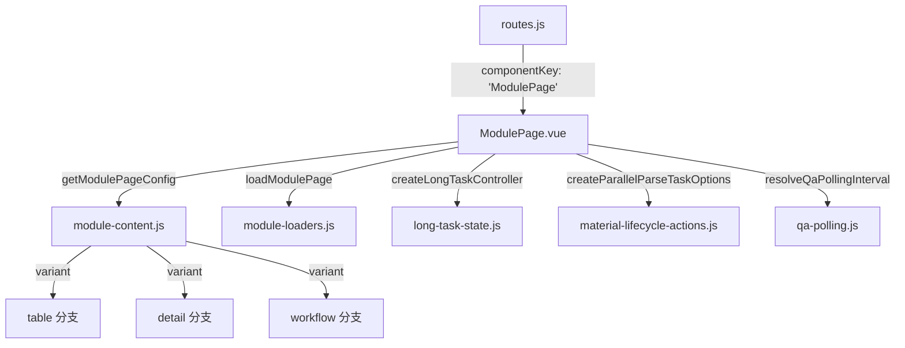
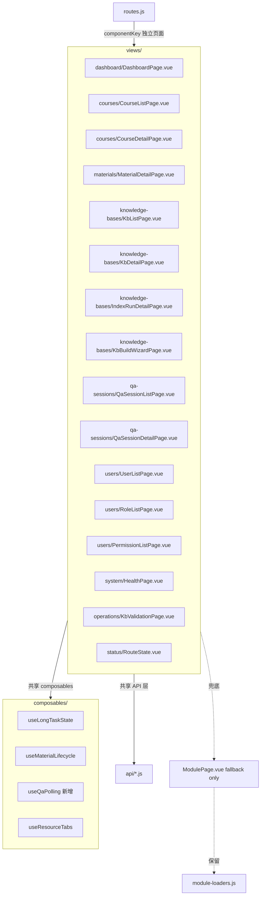
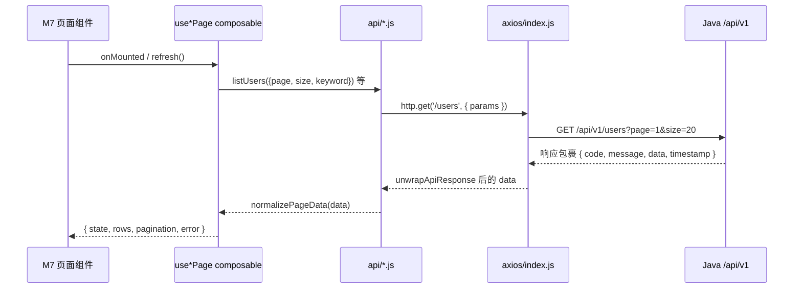
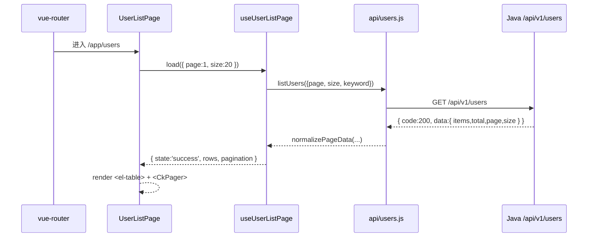
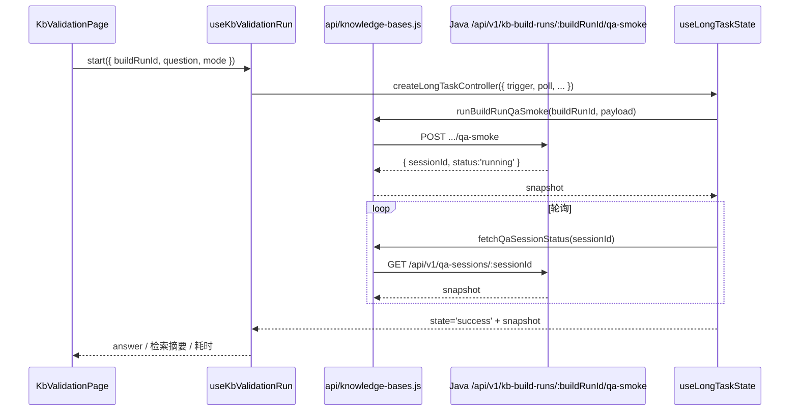
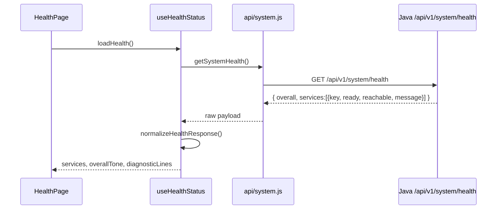

# 设计文档：管理员端 M7 —— 其他页面拆分与适配

- 上位设计：`docs/superpowers/specs/2026-05-07-admin-app-redesign-design.md`
- 本次里程碑：M7（其他页面重刷不重做）
- 范围：用户、角色、权限、系统健康、知识库验证（原 QA 冒烟）、RouteState 占位页；配套从 `views/pages/` 抽取组合式函数；清理 `ModulePage.vue` 到"仅作兜底"状态
- 依赖：M1 设计系统底座、M2 布局壳与导航（已落地）；与 M3/M4/M5/M6 并行且不相互依赖
- 路径基准：`/home/sunlight/Projects/ckqa/.worktrees/admin-redesign-m1-m2/`
- 文档语言：中文

---

## 1. Overview

M7 是"重刷不重做"的收尾里程碑：把上位设计稿第 9 节点名的若干页面从 `ModulePage.vue` 巨石切出来成独立组件、吃上 M1 的设计系统和 M2 的布局壳；同时把 `views/pages/` 下仍残留的非页面逻辑抽到 `composables/`，让 `ModulePage.vue` 真正退化成"兜底 fallback 组件"，不再被任何路由直接引用。

M7 与 M3/M4/M5/M6 并行，但落点文件互不重叠——M3 只碰 `views/dashboard/`、M4 碰 `views/courses/ views/materials/`、M5 碰 `views/knowledge-bases/`、M6 碰 `views/qa-sessions/`，M7 落在 `views/users/ views/system/ views/operations/ views/status/` 四个目录。文件维度零冲突。

本里程碑**不触碰** API 层（`api/*.js`）、Pinia stores、axios 封装，**不改** `/api/v1` 接口契约，仅消费既有数据。

---

## 2. 与现状的差异（强制对齐）

撰写 design.md 之前已阅读当前 worktree 代码，核对了现状与上位设计稿存在若干差异。下面以代码为准，设计在这些差异上向前推进。

### 2.1 路由现状（`frontend/apps/admin-app/src/router/routes.js`）

当前 `componentKey: 'ModulePage'` 的路由**只剩 3 条**（M3~M6 已完成的独立页面拆分现场）：

| 路由 name | path | 当前 componentKey | M7 目标 componentKey |
| --- | --- | --- | --- |
| `users` | `/app/users` | `ModulePage` | `UserListPage` |
| `roles` | `/app/roles` | `ModulePage` | `RoleListPage` |
| `permissions` | `/app/permissions` | `ModulePage` | `PermissionListPage` |
| `health` | `/app/health` | `HealthView` | `HealthPage`（改名 + 视觉刷新） |
| `qa-smoke` | `/app/qa-smoke` | `RouteState` (coming-soon) | `KbValidationPage`（新建真页面） |
| `retrieval-logs` | `/app/retrieval-logs` | `RouteState` (coming-soon) | 视觉刷新 `RouteState`，保持占位 |
| `retrieval-log-detail` | `/app/retrieval-logs/:logId` | `RouteState` (coming-soon) | 同上，仅吃新视觉 |
| `authorization-audit-logs` | `/app/authorization-audit-logs` | `RouteState` (coming-soon) | 同上，仅吃新视觉 |
| `user-detail` | `/app/users/:userId` | `RouteState` (coming-soon) | 保持 RouteState 视觉刷新（不做用户详情） |
| `index-runs` | `/app/knowledge-bases/:kbId/index-runs` | `RouteState` (coming-soon) | 保持 RouteState，不在 M7 拆真页面 |

> **注意**：课程、资料、知识库、问答、构建向导、索引运行详情等页面已在 M3~M6 中拆成独立组件（`CourseListPage / CourseDetailPage / MaterialDetailPage / KbListPage / KbDetailPage / KbBuildWizardPage / IndexRunDetailPage / QaSessionListPage / QaSessionDetailPage`），**M7 不再重复拆分它们**。上位设计稿第 9 节表格中列出的课程/资料/知识库页面，本 spec 只保留"视觉巡检点"条目（见第 11 节），不产生新的页面组件迁移工作。

### 2.2 组合式函数现状（`frontend/apps/admin-app/src/composables/`）

M2 / M3 / M4 已落地了若干 composable：

- `useLongTaskState.js`（已迁移，但 `views/pages/ModulePage.vue` 仍引用旧路径 `./long-task-state.js`）
- `useMaterialLifecycle.js`（已迁移，但 `ModulePage.vue` 仍引用旧路径 `./material-lifecycle-actions.js`）
- `useResourceTabs.js / useDashboardFeed.js / useDashboardSummary.js / useBuildRunStream.js` 等

尚未迁移的 `views/pages/*.js` 残留：

| 现状文件 | M7 目标 |
| --- | --- |
| `views/pages/qa-polling.js` | 迁到 `composables/useQaPolling.js`（新增） |
| `views/pages/long-task-state.js` | 该文件在 worktree 中**可能已不存在实体**，但 `ModulePage.vue` 仍用旧导入路径；统一切到 `composables/useLongTaskState.js` |
| `views/pages/material-lifecycle-actions.js` | 同上，统一切到 `composables/useMaterialLifecycle.js` |
| `views/pages/module-loaders.js` | **保留**：它是 M3~M6 拆出的页面组件（如 `KbDetailPage`）依然依赖的数据装载器，本 M7 不拆它 |
| `views/pages/module-content.js` | 同上，保留作为 build-wizard 相关 helper 的共享 |
| `views/pages/module-page-model.js` | 同上，保留 |

**M7 的迁移策略**：不是把 `module-loaders.js / module-content.js` 全部打散——它们已是多个页面共享的工具层。M7 只负责：① 新增 `useQaPolling.js`；② 修正 `ModulePage.vue` 与测试里的"旧文件路径导入"（指向 `composables/*`）；③ 若 `views/pages/qa-polling.js`、`long-task-state.js`、`material-lifecycle-actions.js` 在 worktree 下仍是独立文件，则在 M7 完成后删除。

### 2.3 文案现状（`src/copy/admin.js`）

`COPY.feedback.kbValidationLabel = '知识库验证'` 已存在，`COPY.status` 已用人话表达；但 `views/pages/module-content.js` 里仍有"冒烟验证"、`views/system/HealthView.vue` 里仍有 "GraphRAG 输出 / MinerU"，`module-page-model.js` 里 `OPERATION_FEEDBACK['qa-smoke']` 的 titles 也仍带"冒烟"字样。M7 将这类残留术语集中清洗到 `copy/admin.js` 并强制走常量引用（见第 8 节）。

### 2.4 知识库验证（原 qa-smoke）现状

**原 `/app/qa-smoke` 业务功能当前只存在于构建向导 `BuildStepQaCheck.vue` 内**，`/app/qa-smoke` 单独入口目前是 coming-soon 占位，而非"功能已有 + 文案要改"。M7 的任务是**在 coming-soon 占位位置落地一个最小可用的 `KbValidationPage`**，复用构建向导已经跑通的 `qa-smoke` API（`runBuildRunQaSmoke` 等），让"验证"能脱离向导独立触发。此为 M7 里唯一的新能力，其他都是重刷。

---

## 3. High-Level Design

### 3.1 架构对比：拆分前 vs 拆分后

**拆分前（`ModulePage.vue` 3957 行）**：



**拆分后（M7 完成）**：



`ModulePage.vue` 在 M7 完成后：① 不再被任何路由直接引用（`routes.js` 内零 `componentKey: 'ModulePage'`）；② 文件仍保留在仓库内，仅作"回滚兜底"——如果某个新页面被发现问题，可临时把该路由 `componentKey` 改回 `'ModulePage'` 快速退回；③ 一轮线上验证稳定后，在后续非 M7 的清理 PR 中删除。

### 3.2 路由表映射（M7 前后对比）

```text
M7 前                                      →  M7 后
---------------------------------------------------------
users          componentKey: ModulePage    →  componentKey: UserListPage
roles          componentKey: ModulePage    →  componentKey: RoleListPage
permissions    componentKey: ModulePage    →  componentKey: PermissionListPage
health         componentKey: HealthView    →  componentKey: HealthPage
qa-smoke       componentKey: RouteState    →  componentKey: KbValidationPage
retrieval-logs componentKey: RouteState    →  componentKey: RouteState（视觉刷新）
*-audit-logs   componentKey: RouteState    →  componentKey: RouteState（视觉刷新）
user-detail    componentKey: RouteState    →  componentKey: RouteState（视觉刷新）
index-runs     componentKey: RouteState    →  componentKey: RouteState（视觉刷新）
```

**路由 path 全部不变**。`qa-smoke` 路由原本是 coming-soon 占位，现在指向真页面，对任何书签 URL 都是前进升级，不是破坏。

### 3.3 组件依赖图

```mermaid
graph LR
  subgraph M7 新增页面
    UserList[UserListPage]
    RoleList[RoleListPage]
    PermissionList[PermissionListPage]
    Health[HealthPage]
    Validation[KbValidationPage]
  end

  subgraph M1 基础组件
    PageHero[CkPageHero]
    StatusPill[CkStatusPill]
    ResourceCard[CkResourceCard]
    Pager[CkPager]
    InfoTable[CkInfoTable]
    EmptyState[CkEmptyState]
    Skeleton[CkSkeleton]
    LogStream[CkLogStream]
    SplitProgress[CkSplitProgress]
  end

  subgraph M2 布局与外壳
    Console[ConsoleLayout]
    Detail[DetailLayout]
    Topbar[AppTopbar]
    Side[SideNavigation]
    Breadcrumbs[CkBreadcrumbs]
  end

  subgraph Element Plus（吃 M1 主题映射）
    ElTable[el-table]
    ElSelect[el-select]
    ElDialog[el-dialog]
    ElInput[el-input]
  end

  UserList --> PageHero
  UserList --> StatusPill
  UserList --> Pager
  UserList --> ElTable
  UserList --> Skeleton
  UserList --> EmptyState
  RoleList --> PageHero
  RoleList --> ElTable
  RoleList --> StatusPill
  PermissionList --> PageHero
  PermissionList --> ElTable
  PermissionList --> StatusPill
  Health --> PageHero
  Health --> StatusPill
  Health --> InfoTable
  Health --> LogStream
  Validation --> PageHero
  Validation --> StatusPill
  Validation --> SplitProgress
  Validation --> LogStream

  UserList --> Console
  RoleList --> Console
  PermissionList --> Console
  Health --> Console
  Validation --> Console

  Console --> Topbar
  Console --> Side
  Detail --> Topbar
  Detail --> Side
  Detail --> Breadcrumbs
```

### 3.4 数据流视图（M7 不改 API 契约）



M7 完全走 M2 已铺好的 Axios + `unwrapApiResponse + normalizePageData` 管道，不新增 axios 拦截器、不新增 Pinia store、不新增全局事件通道。

### 3.5 M7 页面的角色权限差异投射

| 角色 | 用户/角色/权限列表 | 系统健康 | 知识库验证 |
| --- | --- | --- | --- |
| 平台管理员（admin） | 可读、可写（新建/编辑/停用等） | 可读，可触发"刷新健康"以及"详细诊断" | 可读，可发起验证、查看所有验证会话 |
| 教师（teacher） | 不可见（侧栏 `SideNavigation` 按 `permissions: ['user:read']` 过滤隐藏） | 可读（轻量总览），`/system/readiness` 详情只对 admin 开放 | 可读自己课程的验证会话，可对自己课程的 KB 发起验证 |
| 助教（assistant） | 不可见 | 可读轻量总览 | 只读自己参与课程的验证会话；**不能**发起验证 |
| 只读运维（auditor） | 可读，不可写 | 可读，可点击刷新 | 可读全部验证会话，不可发起 |

**实现侧**：M7 页面本身不判断权限，继续走 M2 已经铺好的 `authStore.canAccess(permissionList)`；写操作按钮位用 `v-if="authStore.canAccess(...)"` 守护。侧栏 `SideNavigation` 按 `permissions` 隐藏无权入口的行为已由 M2 实现，M7 直接消费。

### 3.6 暗色主题与可访问性巡检策略

- **暗色验证**：M7 的每个新页面都在 Playwright E2E 下加 `tests/visual/m7-dark.spec.ts`（或沿用 M1 已有 fixtures），在 `data-theme='dark'` 下截图比对，重点盯 `el-table` 表头/偶行斑马条、`el-dialog` 背景、`el-input` 禁用态、`el-tag` 角色徽章等容易漏刷的位置。
- **可访问性**：
  - 所有 `<el-table>` 需要 `aria-label` 描述表格用途；状态列表格单元用 `<CkStatusPill>` 而非裸 `<el-tag>`；
  - 页面标题区走 `<CkPageHero>`；
  - 表格行操作按钮统一写成 `<el-button>` 而非 `<a>` + icon；
  - 通过 `axe-core` 自动化扫描：在 `pnpm test:e2e` 中加 `@axe-core/playwright` smoke，只要求 0 `serious/critical`，0 `color-contrast` 违规。

### 3.7 灰度与可回退策略

M7 的 PR 按页面粒度可独立发布，每个 PR 只改动一个页面组件 + 对应路由条目 + 对应单元/E2E：

1. **UserList → RoleList → PermissionList**：一组三页，但三条路由各自独立，PR 可拆成 3 个。
2. **HealthPage**：替换 `HealthView`，原文件先保留（在 PR 中 `git mv` 后 `sed` 重命名文件名，保留内部实现），M7 结束前 HealthView 可作为手动回退；M7 合并后一周稳定再删除 `HealthView.vue` 文件。
3. **KbValidationPage**：新页面落地，路由从 `RouteState` 换到它；若线上发现问题，改回 `componentKey: 'RouteState'` 就能回到 coming-soon 状态，不会造成数据灾难。
4. **ModulePage fallback**：M7 完成后 `ModulePage.vue` 不被引用，但文件保留至少一轮线上稳定期；`app-shell.test.js` 中保留"ModulePage 可编译"的冒烟测试，防止被意外回归使用但不再走功能路径。

每个 PR 合并后的验证清单（见第 12 节）统一化，保证灰度过程可控。

---

## 4. Sequence Diagrams

### 4.1 用户列表加载



### 4.2 知识库验证（KbValidation）发起一次抽样问答



### 4.3 HealthPage 刷新



---

## 5. 页面组件骨架（Low-Level）

### 5.1 `views/users/UserListPage.vue`

**布局**：`ConsoleLayout`（外层由路由 `layout: 'console'` 决定，页面本身不嵌布局）。

**文件结构骨架**：

```vue
<script setup>
import { computed, onMounted, ref, watch } from 'vue'
import { useRoute, useRouter } from 'vue-router'
import { Plus } from 'lucide-vue-next'

import CkPageHero from '../../components/common/CkPageHero.vue'
import CkPager from '../../components/common/CkPager.vue'
import CkSkeleton from '../../components/common/CkSkeleton.vue'
import CkEmptyState from '../../components/common/CkEmptyState.vue'
import CkStatusPill from '../../components/common/CkStatusPill.vue'
import { useUserListPage } from '../../composables/useUserListPage.js'
import { USER_PAGE_COPY } from './user-page-copy.js'

const route = useRoute()
const router = useRouter()

const {
  state,        // 'idle' | 'loading' | 'success' | 'empty' | 'error'
  rows,         // normalized user rows
  pagination,   // { page, size, total }
  error,
  load,
  refresh,
  setPage,
  setPageSize,
  setKeyword,
} = useUserListPage({ route, router })

onMounted(load)
watch(() => route.query, () => load(), { deep: true })
</script>

<template>
  <CkPageHero
    :eyebrow="USER_PAGE_COPY.list.eyebrow"
    :title="USER_PAGE_COPY.list.title"
    :subtitle="USER_PAGE_COPY.list.subtitle"
  >
    <template #actions>
      <el-button
        v-if="canWriteUser"
        type="primary"
        @click="openCreateDialog"
      >
        <Plus :size="16" />新建用户
      </el-button>
    </template>
  </CkPageHero>

  <CkSkeleton v-if="state === 'loading'" variant="row" :count="6" />

  <CkEmptyState
    v-else-if="state === 'empty'"
    :title="USER_PAGE_COPY.list.empty.title"
    :description="USER_PAGE_COPY.list.empty.description"
  />

  <template v-else-if="state === 'success'">
    <el-table :data="rows" aria-label="用户列表" data-testid="user-table">
      <el-table-column prop="username" label="用户名" min-width="140" />
      <el-table-column prop="displayName" label="展示名称" min-width="160" />
      <el-table-column label="状态" width="120">
        <template #default="{ row }">
          <CkStatusPill :status="row.status" :label="USER_PAGE_COPY.statusLabel(row.status)" />
        </template>
      </el-table-column>
      <el-table-column label="角色" min-width="220">
        <template #default="{ row }">
          <span v-for="role in row.roles" :key="role.code" class="ck-role-tag">
            <CkStatusPill tone="neutral" :label="role.name" size="sm" />
          </span>
        </template>
      </el-table-column>
      <el-table-column prop="lastLoginAt" label="最近登录" width="180" />
      <el-table-column label="操作" width="160" fixed="right">
        <template #default="{ row }">
          <el-button size="small" @click="openEditDialog(row)">编辑</el-button>
          <el-button v-if="canWriteUser" size="small" @click="toggleStatus(row)">
            {{ row.status === 'active' ? '停用' : '启用' }}
          </el-button>
        </template>
      </el-table-column>
    </el-table>

    <CkPager
      variant="page"
      :page="pagination.page"
      :page-size="pagination.size"
      :total="pagination.total"
      @change-page="setPage"
      @change-page-size="setPageSize"
    />
  </template>

  <section v-else class="ck-error-panel" role="alert">
    <!-- 沿用 M2 已有的错误面板样式 -->
    {{ error?.message }}
  </section>
</template>
```

**props / emits / slots**：不对外暴露——页面级组件，由路由直接挂载。

**行数目标**：≤ 280 行。超出时把 `el-table` 的列定义抽到 `user-list-columns.js`。

### 5.2 `views/users/RoleListPage.vue`

**结构**：与 UserListPage 同构；数据来自 `api/users.js` 扩展（M7 在 `api/users.js` 新增 `listRoles / listPermissions`，或放新文件 `api/roles.js / api/permissions.js`——优先扩展现有 `users.js` 避免文件爆炸，除非第一版就超过 120 行）。

**列**：角色编码 / 角色名称 / 状态 / 权限范围（字符串拼接，来自 `role.permissions[].name`，超过 3 个显示 `前三名 + 等 N 项`）/ 更新时间 / 操作。

**行数目标**：≤ 240 行。

### 5.3 `views/users/PermissionListPage.vue`

**列**：权限编码 / 权限名称 / 资源（`course / material / kb / qa / user / role / permission / system`）/ 操作（`read / write / *`）/ 状态。

**筛选器**：资源维度（复用 `el-select`）。

**行数目标**：≤ 220 行。

### 5.4 `views/system/HealthPage.vue`

替换现状 `HealthView.vue`。

```vue
<script setup>
import { computed, onMounted } from 'vue'
import { RefreshCw } from 'lucide-vue-next'

import CkPageHero from '../../components/common/CkPageHero.vue'
import CkStatusPill from '../../components/common/CkStatusPill.vue'
import CkInfoTable from '../../components/common/CkInfoTable.vue'
import CkLogStream from '../../components/common/CkLogStream.vue'
import CkSkeleton from '../../components/common/CkSkeleton.vue'
import HealthMatrix from '../../components/system/HealthMatrix.vue'

import { useHealthStatus } from '../../composables/useHealthStatus.js'
import { HEALTH_PAGE_COPY } from './health-page-copy.js'

const {
  state,          // 'idle' | 'loading' | 'success' | 'error'
  overallTone,    // 'success' | 'warning' | 'danger' | 'blocked'
  overallLabel,   // 人话 label（如"全部服务正常"）
  services,       // { key, name, tone, label, message, ready, reachable }[]
  diagnostics,    // 文本行数组，给 CkLogStream
  refreshedAt,
  loadHealth,
} = useHealthStatus()

onMounted(loadHealth)
</script>

<template>
  <CkPageHero
    :eyebrow="HEALTH_PAGE_COPY.eyebrow"
    :title="HEALTH_PAGE_COPY.title"
    :subtitle="HEALTH_PAGE_COPY.subtitle"
  >
    <template #actions>
      <CkStatusPill :tone="overallTone" :label="overallLabel" />
      <el-button type="primary" :disabled="state === 'loading'" @click="loadHealth">
        <RefreshCw :size="16" />刷新
      </el-button>
    </template>
  </CkPageHero>

  <CkSkeleton v-if="state === 'loading'" variant="card" :count="3" />

  <template v-else-if="state === 'success'">
    <section class="ck-service-grid" aria-label="依赖服务健康状态">
      <article
        v-for="svc in services"
        :key="svc.key"
        class="ck-service-card ck-glass-card"
      >
        <header>
          <h3>{{ svc.name }}</h3>
          <CkStatusPill :tone="svc.tone" :label="svc.label" />
        </header>
        <p v-if="svc.message" class="ck-service-card-message">{{ svc.message }}</p>
        <CkInfoTable :entries="svc.details" :columns="2" />
      </article>
    </section>

    <section class="ck-panel">
      <h3>{{ HEALTH_PAGE_COPY.diagnosticsTitle }}</h3>
      <CkLogStream :lines="diagnostics" :auto-follow="false" />
    </section>
  </template>
</template>
```

**文案升级**：
- 去掉现状 `HealthView.vue` 里的 `"Java 编排入口健康检查 / MySQL、PDF 解析、GraphRAG 输出和问答服务状态"`；
- 标题：`系统健康`，副标：`平台依赖服务的当前状态，点击刷新重新检测`；
- `diagnostics` 每行由 `useHealthStatus` 清洗为："操作系统数据库：可达 / 就绪"、"PDF 解析：可达 / 解析队列空闲"（原 MinerU / embedding 等内部术语不进入 UI）。

**原文件去向**：`HealthView.vue` 通过 `smartRelocate` 到 `HealthPage.vue`（同目录改名），同时在文件内替换模板与文案。`api/system.js` 与 `views/system/health-model.js` 不动。

### 5.5 `views/operations/KbValidationPage.vue`

新建目录 `views/operations/`。页面作用：脱离构建向导，独立选择知识库 + 输入问题，对当前激活索引发起一次"抽样问答"。

**骨架**：

```vue
<script setup>
import { computed, onMounted, ref } from 'vue'
import { useRoute, useRouter } from 'vue-router'
import { Play } from 'lucide-vue-next'

import CkPageHero from '../../components/common/CkPageHero.vue'
import CkStatusPill from '../../components/common/CkStatusPill.vue'
import CkSplitProgress from '../../components/common/CkSplitProgress.vue'
import CkLogStream from '../../components/common/CkLogStream.vue'
import CkEmptyState from '../../components/common/CkEmptyState.vue'

import { useKbValidationRun } from '../../composables/useKbValidationRun.js'
import { VALIDATION_PAGE_COPY } from './kb-validation-copy.js'

const route = useRoute()
const router = useRouter()

const {
  knowledgeBases,
  selectedKbId,
  selectedIndexRunId,
  question,
  mode,             // 'basic' | 'local' | 'global' | 'drift'
  runState,         // 'idle' | 'running' | 'success' | 'failed'
  runSnapshot,      // { sessionId, answer, sources[], timings{} }
  history,          // 近 10 次在当前浏览器会话内发起的验证
  start,
  reset,
} = useKbValidationRun({ route, router })

onMounted(() => void loadInitial())
</script>

<template>
  <CkPageHero
    :eyebrow="VALIDATION_PAGE_COPY.eyebrow"
    :title="VALIDATION_PAGE_COPY.title"
    :subtitle="VALIDATION_PAGE_COPY.subtitle"
  />

  <section class="ck-validation-grid">
    <article class="ck-panel ck-validation-form">
      <h3>{{ VALIDATION_PAGE_COPY.form.title }}</h3>
      <el-form label-position="top">
        <el-form-item :label="VALIDATION_PAGE_COPY.form.kbLabel">
          <el-select v-model="selectedKbId" filterable>
            <el-option v-for="kb in knowledgeBases" :key="kb.id" :value="kb.id" :label="kb.name" />
          </el-select>
        </el-form-item>
        <el-form-item :label="VALIDATION_PAGE_COPY.form.questionLabel">
          <el-input v-model="question" type="textarea" :rows="3" maxlength="500" show-word-limit />
        </el-form-item>
        <el-form-item :label="VALIDATION_PAGE_COPY.form.modeLabel">
          <el-radio-group v-model="mode">
            <el-radio-button label="basic">快速</el-radio-button>
            <el-radio-button label="local">课程内</el-radio-button>
            <el-radio-button label="global">跨课程</el-radio-button>
          </el-radio-group>
        </el-form-item>
        <el-button
          type="primary"
          :disabled="!selectedKbId || runState === 'running'"
          @click="start"
        >
          <Play :size="16" />发起验证
        </el-button>
      </el-form>
    </article>

    <article class="ck-panel ck-validation-result">
      <header>
        <h3>{{ VALIDATION_PAGE_COPY.result.title }}</h3>
        <CkStatusPill v-if="runState !== 'idle'" :tone="runState" :label="VALIDATION_PAGE_COPY.result.stateLabel(runState)" />
      </header>

      <CkEmptyState
        v-if="runState === 'idle'"
        :title="VALIDATION_PAGE_COPY.result.empty.title"
        :description="VALIDATION_PAGE_COPY.result.empty.description"
      />

      <CkSplitProgress
        v-else-if="runState === 'running'"
        :steps="VALIDATION_PAGE_COPY.result.stages"
        :current-step="runSnapshot?.currentStage"
        :current-pct="runSnapshot?.stagePercent"
      />

      <div v-else-if="runState === 'success'" class="ck-validation-answer">
        <p class="ck-validation-answer-text">{{ runSnapshot.answer }}</p>
        <dl class="ck-validation-timings">
          <div><dt>检索</dt><dd>{{ runSnapshot.timings.retrievalMs }} ms</dd></div>
          <div><dt>模型生成</dt><dd>{{ runSnapshot.timings.generationMs }} ms</dd></div>
        </dl>
        <CkLogStream :lines="runSnapshot.traceLines" :auto-follow="false" />
      </div>

      <p v-else class="ck-inline-error">{{ runSnapshot?.errorMessage }}</p>
    </article>
  </section>

  <section class="ck-panel">
    <h3>{{ VALIDATION_PAGE_COPY.history.title }}</h3>
    <!-- history 近 10 条记录，使用 el-table 的最小实现 -->
  </section>
</template>
```

**关键约束**：
- `KbValidationPage` **不重写** `/api/v1` 接口，它复用 `api/knowledge-bases.js:runBuildRunQaSmoke`（或其等价的 QA session 触发接口）+ `api/qa-sessions.js` 的会话查询。
- 由于当前"冒烟/验证"功能被绑在 build-run 上，当用户不在向导中发起验证时，M7 需要对应的 `api/knowledge-bases.js` 支持"对当前激活索引直接发起一次验证" —— 若后端目前只支持按 `buildRunId` 触发，则 `useKbValidationRun` 内部实现：① 读取所选 KB 的 `activeIndexRunId`；② 找到与之关联的 `buildRunId`；③ 调用 `runBuildRunQaSmoke(buildRunId, ...)`。这不需要后端新增接口。
- 历史记录**只在浏览器会话内**保存（M7 不上数据库，不新增 API），进入 `localStorage.ckqa.validation.history`（最多 20 条，按时间倒序显示 10 条）。
- 文案完全不出现"冒烟 / smoke / embedding / P95 / MinerU"。

**行数目标**：≤ 400 行。超过时把 `ck-validation-form`、`ck-validation-result` 抽成同目录下 `components/ValidationForm.vue` 与 `components/ValidationResult.vue`。

### 5.6 `views/status/RouteState.vue`（视觉升级，不重写）

当前 `RouteState.vue` 已覆盖 `coming-soon / forbidden / not-found / server-error` 四种状态。M7 的修改面：

- 顶部大图"品牌图形"占位：用 `<figure class="ck-route-state-illustration" />` + CSS 背景的径向渐变实现暖橙氛围（与 AuthLayout 的登录页同款，使用 `--ckqa-accent-soft / --ckqa-bg-elevated` Token）；
- 移除内嵌的 `.eyebrow`、`.route-state__facts` 的自定义色值，全部走 Token；
- 按钮去除 `ckqa-el-button ckqa-el-button--primary` 这类已被 M2 Element Plus 主题映射覆盖的类名，直接写 `<el-button type="primary">`；
- 保留现有 `navGroupLabels / statusLabels / copy` 逻辑，不动文案结构；
- `/app/retrieval-logs` 列表占位的 `moduleLabel` 显示为"运维 · 检索日志"，而不是现在的 `navGroup` 兜底。

**变更面**：只改 `<template>` 与 `<style scoped>`，`<script setup>` 基本不动。

---

## 6. Composables（Low-Level）

### 6.1 新增 `composables/useQaPolling.js`

从 `views/pages/qa-polling.js` 迁移而来，API 不变，导出函数签名：

```js
// resolveQaPollingInterval: 依据会话状态返回下一次轮询间隔（毫秒）
export function resolveQaPollingInterval({ status, elapsedMs, config? }): number

// resolveQaStaleTimeout: 依据会话类型返回过期超时（毫秒）
export function resolveQaStaleTimeout({ mode, kind }): number
```

**迁移策略**：
1. `git mv src/views/pages/qa-polling.js src/composables/useQaPolling.js`；
2. 文件头换掉 `export` 顺序不重要，保持 API 对外一致；
3. `src/app-shell.test.js` 的 import 由 `./views/pages/qa-polling.js` 改为 `./composables/useQaPolling.js`；
4. 若 `ModulePage.vue` 或其他文件仍 `import` 这个模块，同步修改路径。

### 6.2 `composables/useLongTaskState.js` 与 `composables/useMaterialLifecycle.js`

这两个文件已在 worktree 下存在。M7 只做**路径收口**：

1. 在 `src/views/pages/` 下删除旧兄弟文件 `long-task-state.js / material-lifecycle-actions.js`（若仍存在）。
2. `src/views/pages/ModulePage.vue` 内的 `import from './long-task-state.js'` 改为 `'../../composables/useLongTaskState.js'`；`import from './material-lifecycle-actions.js'` 改为 `'../../composables/useMaterialLifecycle.js'`。
3. `src/app-shell.test.js` 同步修正 import 路径。
4. 运行 `pnpm test` + `pnpm build` 验证。

> **不迁移** `module-loaders.js / module-content.js / module-page-model.js`——它们仍被多个已拆出的页面（如 `KbDetailPage`、`CourseDetailPage`）依赖，作为工具层长期保留。

### 6.3 页面专属组合式函数（M7 新增）

按"每页一个 composable"拆分，避免页面组件塞逻辑：

| Composable | 页面 | 核心职责 |
| --- | --- | --- |
| `composables/useUserListPage.js` | UserListPage | 从 `listUsers` 装载 + 管理 `page / size / keyword` query 状态 |
| `composables/useRoleListPage.js` | RoleListPage | 同上，走 `listRoles` |
| `composables/usePermissionListPage.js` | PermissionListPage | 同上，走 `listPermissions`，含 `resource` 筛选 |
| `composables/useHealthStatus.js` | HealthPage | 装载 + `normalizeHealthResponse` + 诊断行拼接（含术语清洗） |
| `composables/useKbValidationRun.js` | KbValidationPage | 发起验证 + 轮询会话状态 + 历史存取 |

### 6.4 `composables/useUserListPage.js` 签名示例

```js
// 导出函数
export function useUserListPage({ route, router }): {
  state: Ref<'idle' | 'loading' | 'success' | 'empty' | 'error'>
  rows: Ref<UserRow[]>
  pagination: Ref<{ page: number, size: number, total: number }>
  error: Ref<ApiError | null>
  keyword: Ref<string>
  load(): Promise<void>
  refresh(): Promise<void>
  setPage(page: number): void
  setPageSize(size: number): void
  setKeyword(keyword: string): void
}

// 内部状态
//   - requestGuard: 沿用 `views/pages/module-page-model.js:createStaleRequestGuard()`
//   - query: 从 route.query 读取 { page, size, keyword }，写回走 router.replace
//   - service: 默认 `listUsers`，测试时注入
```

### 6.5 `composables/useHealthStatus.js` 签名示例

```js
export function useHealthStatus(options?: {
  getHealthService?: () => Promise<HealthPayload>,   // 测试注入
}): {
  state: Ref<'idle' | 'loading' | 'success' | 'error'>
  overallTone: ComputedRef<'success' | 'warning' | 'danger' | 'blocked'>
  overallLabel: ComputedRef<string>
  services: ComputedRef<ServiceCard[]>
  diagnostics: ComputedRef<string[]>
  refreshedAt: Ref<string>
  error: Ref<string>
  loadHealth(): Promise<void>
}
```

`diagnostics[]` 每行格式：`"{service.displayName}：{reachLabel} / {readyLabel} {清洗后的 message}"`，清洗规则见 8.3。

### 6.6 `composables/useKbValidationRun.js` 签名示例

```js
export function useKbValidationRun({ route, router }): {
  knowledgeBases: Ref<KbOption[]>
  selectedKbId: Ref<string>
  selectedIndexRunId: ComputedRef<number | null>
  question: Ref<string>
  mode: Ref<'basic' | 'local' | 'global' | 'drift'>
  runState: Ref<'idle' | 'running' | 'success' | 'failed'>
  runSnapshot: Ref<ValidationSnapshot | null>
  history: Ref<ValidationHistoryItem[]>
  start(): Promise<void>
  reset(): void
}
```

内部复用 `createLongTaskController` from `useLongTaskState`，`trigger` 调用 `runBuildRunQaSmoke`，`poll` 调用 `getQaSession`。

---

## 7. `ModulePage.vue` → 独立页面逻辑迁移映射表

M7 不把 `ModulePage.vue` 整体拆解（前述已做过），但它当前仍是 `users / roles / permissions` 路由的真渲染组件。M7 需要**从 ModulePage 内抽取"表格 + 分页 + 筛选"这一段通用渲染**，使新的 UserListPage / RoleListPage / PermissionListPage 能直接跑起来。

| 源（`ModulePage.vue` / `module-content.js` / `module-loaders.js`） | 目标 |
| --- | --- |
| `module-content.js: configs.users / configs.roles / configs.permissions`（filters / columns / primaryAction） | 展开到各 `views/users/*-page-copy.js`，常量不再通过 `getModulePageConfig(routeName)` 查表 |
| `ModulePage.vue` 里的 table 分支渲染（`StatusBadge`、`DataTableShell`、filters、pagination） | 新页面直接用 `<el-table>` + `<CkStatusPill>` + `<CkPager>`，弃用 `DataTableShell` 这一轮 |
| `ModulePage.vue` 里 `creationDialog / creationForm / creationState` | 新页面内部维护，配合 `creation-form-model.js`；角色/权限页第一版不做创建，primaryAction 隐藏 |
| `ModulePage.vue` 里的 `LONG_TASK_LIMITS / createLongTaskController` 的调用 | 用户/角色/权限的 CRUD 操作不是长任务，不需要走长任务控制器；后续复杂操作再引入 |

**users/roles/permissions 的 create / edit / delete 行为定义**：

- **users**：第一版只做 `列表 + 搜索 + 状态切换 (active/inactive)`。"新建用户 / 分配角色"的按钮在 primaryAction 上**禁用**并带 tooltip："后续里程碑开放"。这与 `routes.js` 注释的"用户详情 coming-soon"保持一致。
- **roles**：第一版只做 `列表 + 搜索`。创建 / 分配权限按钮禁用。
- **permissions**：第一版只做 `列表 + 搜索 + 资源筛选`。创建按钮禁用。

这样 M7 的范围严格是**"视觉与结构升级 + 侧栏可跳转 + 页面不再是 ModulePage"**，不越权做业务增量。

---

## 8. 文案（`copy/admin.js`）收口

### 8.1 M7 涉及的文案键

在 `copy/admin.js` 的 `COPY` 常量下新增：

```js
COPY.system = {
  health: {
    eyebrow: '设置 · 系统',
    title: '系统健康',
    subtitle: '平台依赖服务的当前状态，点击刷新重新检测。',
    diagnosticsTitle: '诊断日志',
    overall: {
      success: '全部服务正常',
      warning: '部分服务存在告警',
      danger: '存在不可用服务',
      blocked: '尚未完成初始化',
    },
    service: {
      mysql: { name: '操作系统数据库' },
      graphrag: { name: 'GraphRAG 问答服务' },   // 专业术语保留
      pdfIngest: { name: 'PDF 解析服务' },
      minio: { name: '对象存储' },
      oneApi: { name: '模型网关' },
    },
  },
}

COPY.users = {
  list: {
    eyebrow: '设置 · 用户与权限',
    title: '用户',
    subtitle: '维护平台登录账号与其关联的角色。',
    empty: { title: '暂无用户', description: '管理员可在后续版本新增用户。' },
  },
  status: {
    active: '已启用',
    inactive: '已停用',
    locked: '已锁定',
  },
}

COPY.roles = {
  list: {
    eyebrow: '设置 · 用户与权限',
    title: '角色',
    subtitle: '平台级权限集合，用于批量授予用户能力。',
    empty: { title: '暂无角色', description: '默认提供管理员 / 教师 / 助教 / 学生四类角色。' },
  },
}

COPY.permissions = {
  list: {
    eyebrow: '设置 · 用户与权限',
    title: '权限',
    subtitle: '最小权限点清单，按资源与操作分组。',
    empty: { title: '暂无权限', description: '权限点由系统初始化生成。' },
  },
}

COPY.validation = {
  page: {
    eyebrow: '运维 · 知识库验证',
    title: '知识库验证',
    subtitle: '选择一个知识库，输入问题并发起一次抽样问答，快速检查索引是否可用。',
    empty: {
      title: '尚未发起验证',
      description: '选择知识库、填入问题后点击「发起验证」。',
    },
    stages: [
      { key: 'prepare', label: '准备输入' },
      { key: 'retrieve', label: '检索课程知识' },
      { key: 'generate', label: '生成答复' },
      { key: 'finalize', label: '整理结果' },
    ],
    historyTitle: '最近 10 次验证',
  },
  mode: {
    basic: '快速',
    local: '课程内',
    global: '跨课程',
    drift: '深度',
  },
  stateLabel: {
    idle: '待开始',
    running: '验证中',
    success: '验证完成',
    failed: '验证失败',
  },
}

COPY.routeState = {
  comingSoon: {
    title: '敬请期待',
    description: '该入口已保留在导航结构中，后续里程碑接入业务能力。',
  },
}
```

已有的 `COPY.feedback.kbValidationLabel` 与 `COPY.status.*` 保持原值。

### 8.2 术语清洗规则

- **禁用词**：`冒烟`、`smoke`、`embedding`、`嵌入`、`实体抽取`、`P95`、`MinerU`（除系统健康的专业信息外）。
- **替换映射**：

  | 出现位置 | 禁用词 | 替换为 |
  | --- | --- | --- |
  | UI 可见文案 | 冒烟 / 冒烟验证 / smoke | 知识库验证 / 抽样问答 |
  | UI 可见文案 | embedding / 嵌入 | 检索索引 |
  | UI 可见文案 | 实体抽取 | 识别课程概念 |
  | UI 可见文案 | P95 延迟 / latency | 响应时间（高负载下） |
  | UI 可见文案 | MinerU | PDF 解析服务 |

- **允许保留位置**：审计日志原文、内部 `data-*` 属性、E2E `data-testid`、注释、`api/client.js` 错误码描述、`api/system.js` 返回的后端原 payload（仅不在 UI 直接渲染即可）。

- **M7 清洗的具体文件**：
  - `views/system/HealthView.vue` → `HealthPage.vue`：替换 `"Java 编排入口健康检查"` / `"MySQL、PDF 解析、GraphRAG 输出和问答服务"` / 空白态 `"等待 GET /api/v1/system/health 返回"`；
  - `views/pages/module-page-model.js: OPERATION_FEEDBACK['qa-smoke']`：`titles.*` 从"问答冒烟验证..."改为"知识库验证..."，并更新 `resolveOperationMessage` 的 successMessage；
  - `views/pages/module-content.js`：`configs['qa-sessions']` 的 `filters` 里 `options: ['全部', '正式问答', '冒烟验证']` 改为 `['全部', '正式问答', '知识库验证']`，`secondaryAction.label` 同步；
  - `views/knowledge-bases/kb-build-copy.js`（如果存在"冒烟"字样，同步改"知识库验证"）。

### 8.3 HealthPage 诊断日志文案规则

`useHealthStatus` 拼接诊断行的逻辑（伪代码，按 `composable` 粒度实现）：

```text
对每个 service：
  reachLabel = service.reachable ? "可达" : "不可达"
  readyLabel = service.ready ? "就绪" : "未就绪"
  displayName = COPY.system.health.service[service.key].name ?? service.name
  message = cleanTerms(service.message, COPY.termReplacementMap)
  line = `${displayName}：${reachLabel} / ${readyLabel}${message ? '　' + message : ''}`
```

`cleanTerms` 是一个导出到 `copy/admin.js` 的工具函数，M7 顺带实现：

```js
export function cleanTerms(text, map): string {
  let result = String(text ?? '')
  for (const [pattern, replacement] of Object.entries(map)) {
    result = result.replace(new RegExp(pattern, 'gi'), replacement)
  }
  return result
}

export const TERM_REPLACEMENT_MAP = {
  '冒烟验证': '知识库验证',
  '冒烟': '抽样',
  'smoke': 'sampling',
  'embedding(s)?': '检索索引',
  '嵌入': '检索索引',
  '实体抽取': '识别课程概念',
  'P95\\s*延迟': '响应时间',
  'MinerU': 'PDF 解析服务',
}
```

---

## 9. 路由配置改动清单

在 `src/router/routes.js` 内：

```diff
 { path: '/app/health', name: 'health',
-  componentKey: 'HealthView', ...
+  componentKey: 'HealthPage', ...
 },
 { path: '/app/qa-smoke', name: 'qa-smoke',
-  componentKey: 'RouteState', props: { state: 'coming-soon' },
+  componentKey: 'KbValidationPage',
   meta: {
     title: '知识库验证',
     layout: 'console',
     permissions: ['qa:read'],
-    status: 'upcoming',
-    routeState: 'coming-soon',
+    status: 'mvp',
     navGroup: 'qa',
     section: 'operations',
+    keepAlive: true,
   },
 },
 { path: '/app/users', name: 'users',
-  componentKey: 'ModulePage',
+  componentKey: 'UserListPage',
   ...
 },
 { path: '/app/roles', name: 'roles',
-  componentKey: 'ModulePage',
+  componentKey: 'RoleListPage',
   ...
 },
 { path: '/app/permissions', name: 'permissions',
-  componentKey: 'ModulePage',
+  componentKey: 'PermissionListPage',
   ...
 },
```

在 `src/router/index.js` 的组件字典里：

```diff
-import HealthView from '../views/system/HealthView.vue'
-import ModulePage from '../views/pages/ModulePage.vue'
+import HealthPage from '../views/system/HealthPage.vue'
+import UserListPage from '../views/users/UserListPage.vue'
+import RoleListPage from '../views/users/RoleListPage.vue'
+import PermissionListPage from '../views/users/PermissionListPage.vue'
+import KbValidationPage from '../views/operations/KbValidationPage.vue'
+import ModulePage from '../views/pages/ModulePage.vue'  // 保留，兜底
 const components = {
   ...
-  HealthView,
+  HealthPage,
+  UserListPage,
+  RoleListPage,
+  PermissionListPage,
+  KbValidationPage,
   ModulePage,
   RouteState,
   UnifiedErrorView,
 }
```

`primaryNavigation` 不改动 —— `knowledge-bases / users / kb-validation / health` 这四条侧栏 item 的 `path` 与 `permissions` 都保持原样。

---

## 10. 测试策略

### 10.1 单元测试

每个新页面至少一套单元测试，放在同目录 `*.test.js`：

```
views/users/UserListPage.test.js        # mount + el-table 渲染 + 分页联动
views/users/RoleListPage.test.js
views/users/PermissionListPage.test.js
views/system/HealthPage.test.js         # 健康状态聚合、诊断行生成、术语清洗
views/operations/KbValidationPage.test.js

composables/useUserListPage.test.js
composables/useRoleListPage.test.js
composables/usePermissionListPage.test.js
composables/useHealthStatus.test.js
composables/useKbValidationRun.test.js
composables/useQaPolling.test.js        # 从 views/pages/qa-polling 的测试迁移过来
```

`copy/admin.test.js`（已有 `brand.test.js`，新增 `admin.test.js`）：

- 断言 `COPY` 下所有字符串值不包含 `/冒烟|embedding|实体抽取|P95|MinerU/i`；
- 断言 `TERM_REPLACEMENT_MAP` 的每个 key 都能正确替换示例串；
- 断言 `cleanTerms("冒烟验证已提交", MAP) === "知识库验证已提交"` 等具体用例。

### 10.2 Playwright E2E

- `tests/e2e/m7-users.spec.ts`：登录 admin → 进入 `/app/users` → 断言有 `data-testid="user-table"` → 至少 1 行；切换分页不报错。
- `tests/e2e/m7-health.spec.ts`：登录 admin → 进入 `/app/health` → 点击"刷新"→ 断言页头出现 `CkStatusPill` 且不含禁用术语；在 `data-theme='dark'` 下重复一次并截图。
- `tests/e2e/m7-validation.spec.ts`：登录 admin → 进入 `/app/qa-smoke` → 选择一个有激活索引的知识库 → 输入问题"请介绍一下本课程的主要章节"→ 点击发起验证 → 轮询到完成 → 断言答复文本非空；对 mock 服务端 500 响应，断言错误文案平实。

所有 E2E 用例**强制使用 `data-testid` 选择器**而非文本匹配，避免文案清洗再次触发用例红。

### 10.3 视觉巡检

复用 M2 搭好的 Playwright 视觉快照：

- 新增 4 个快照（UserList / RoleList / PermissionList / HealthPage / KbValidationPage）× 2 主题 = 10 张基准图；
- 允许误差 0.3%。

---

## 11. 范围边界（明确不做）

M7 **不做**：

1. 不实现用户 / 角色 / 权限的 CRUD 写操作；primaryAction 按钮禁用带 tooltip。
2. 不实现用户详情 `/app/users/:userId` 的真页面；维持 RouteState coming-soon。
3. 不实现检索日志 `/app/retrieval-logs` 的真页面；维持 RouteState coming-soon，只做视觉刷新。
4. 不实现授权审计日志 `/app/authorization-audit-logs` 的真页面。
5. 不替换 `DataTableShell.vue` 在 M3~M6 已完成页面中的使用，仅在 M7 新页面里直接用 `<el-table>`。
6. 不删除 `ModulePage.vue` 文件本身，只使其不被路由引用。真正删除放在后续"清理"PR。
7. 不触碰 `api/*.js` 的函数签名与响应处理；新增 `listRoles / listPermissions` 时保持 `listUsers` 同款 `params / normalizePageData` 约定。
8. 不引入新图表库（ECharts / D3）；系统健康只用 CkStatusPill + CkInfoTable + CkLogStream。
9. 不引入 WebSocket / SSE 新通道；KbValidationPage 使用 `useLongTaskState` 做轮询。

---

## 12. 与其他里程碑的冲突面（并行验证）

按模块切片后，M7 与其他里程碑的文件冲突面如下，列出后证明**零冲突**：

| 目录 / 文件 | M3 Dashboard | M4 课程/资料 | M5 构建向导 | M6 问答 | M7 本里程碑 |
| --- | --- | --- | --- | --- | --- |
| `views/dashboard/` | ✔ 主要改动面 | - | - | - | - |
| `views/courses/` | - | ✔ 主要改动面 | - | - | - |
| `views/materials/` | - | ✔ 主要改动面 | - | - | - |
| `views/knowledge-bases/KbBuildWizardPage.vue` | - | - | ✔ 主要改动面 | - | - |
| `views/knowledge-bases/KbListPage.vue / KbDetailPage.vue / IndexRunDetailPage.vue` | - | - | 只读引用 | - | - |
| `views/qa-sessions/` | - | - | - | ✔ 主要改动面 | - |
| `views/users/` | - | - | - | - | ✔ 新增 |
| `views/system/HealthView.vue → HealthPage.vue` | - | - | - | - | ✔ 改名 |
| `views/operations/KbValidationPage.vue` | - | - | - | - | ✔ 新增 |
| `views/status/RouteState.vue` | - | - | - | - | ✔ 视觉刷新 |
| `composables/useQaPolling.js` | - | - | - | 可能引用 | ✔ 新增（从 `views/pages/qa-polling.js` 迁移） |
| `composables/useLongTaskState.js / useMaterialLifecycle.js` | - | M4 引用 | M5 引用 | M6 引用 | ✔ 路径收口 |
| `router/routes.js` | 可能读 | 可能读 | 可能读 | 可能读 | ✔ 改 5 条 componentKey |
| `router/index.js` | 可能读 | 可能读 | 可能读 | 可能读 | ✔ 新增 5 个 import |
| `copy/admin.js` | ✔ dashboard 段 | ✔ course/material 段 | ✔ kbBuild 段 | ✔ qa 段 | ✔ system / users / roles / permissions / validation 段 |
| `views/pages/ModulePage.vue` | - | - | - | - | ✔ 修路径 import（长任务/生命周期/轮询） |
| `views/pages/module-content.js / module-loaders.js / module-page-model.js` | 否 | 否 | 否 | 否 | ✔ 清理"冒烟"字样，数据函数保留 |
| `app-shell.test.js` | 可能改 | 可能改 | 可能改 | 可能改 | ✔ 调整 `qa-polling / long-task-state / material-lifecycle` 的 import 路径 |

**唯一的并行协调点**是 `router/routes.js / router/index.js / copy/admin.js / app-shell.test.js`。解决策略：
- M7 的 `routes.js` 只新增/改动 5 条 `componentKey` 和 1 条 `status / keepAlive / routeState`，diff 小且结构稳定，其他里程碑若动 `routes.js` 也主要是 `meta.section` / `permissions`，冲突可 3-way merge；
- `copy/admin.js` 已按"每域一个子键"分组，M7 新增键空间独立；
- `app-shell.test.js` 只动 import 路径，不改测试断言，冲突极易解决。

---

## 13. Correctness Properties（属性测试清单）

M7 是 UI 结构迁移，业务逻辑变更极少，因此属性测试聚焦"迁移一致性"：

### 13.1 路由表一致性

**属性 P1**：所有原 `componentKey: 'ModulePage'` 的路由（M7 前）在 M7 完成后都必须指向一个存在的非 `ModulePage` 独立组件。

```text
∀ route ∈ M7_TARGET_ROUTES:
  route.componentKey ≠ 'ModulePage'
  ∧ ROUTE_COMPONENT_MAP[route.componentKey] is a Vue component constructor
```

**测试实现**：在 `app-shell.test.js` 新增一个 property-style 测试，用 `fast-check` 从 `APP_ROUTES` 里任取一条，断言 `components[route.componentKey]` 能被解析且不是 `ModulePage`。

### 13.2 文案一致性（禁用术语）

**属性 P2**：`COPY` 对象树里所有字符串 leaf 值均不包含禁用术语。

```js
fc.assert(fc.property(
  fc.constantFrom(...allStringLeaves(COPY)),
  (leaf) => !/冒烟|embedding|实体抽取|P95|MinerU/i.test(leaf),
))
```

**测试文件**：`src/copy/admin.test.js`。

**属性 P3**：对任意包含禁用术语的输入串，`cleanTerms` 的输出不再包含该术语。

```js
fc.assert(fc.property(
  fc.tuple(fc.stringOf(fc.char()), fc.constantFrom(...Object.keys(TERM_REPLACEMENT_MAP))),
  ([noise, term]) => {
    const input = noise + term + noise
    const output = cleanTerms(input, TERM_REPLACEMENT_MAP)
    return !new RegExp(term, 'i').test(output)
  },
))
```

### 13.3 组合式函数迁移一致性

**属性 P4**：`composables/useQaPolling.js` 导出的 `resolveQaPollingInterval / resolveQaStaleTimeout` 对任意合法输入给出与旧 `views/pages/qa-polling.js` 完全一致的返回值。

```js
// 迁移期间保留旧文件一小段时间，跑对比
fc.assert(fc.property(
  fc.record({ status: fc.string(), elapsedMs: fc.integer({ min: 0, max: 600000 }) }),
  (input) => resolveQaPollingInterval(input) === oldResolveQaPollingInterval(input),
))
```

执行完成后，删除对比测试 + 旧文件。

### 13.4 路由 path 不变

**属性 P5**：M7 的改动前后，`STATUS_ROUTES` 和 `APP_ROUTES` 的 `path` 集合完全相等。

```js
// snapshot 对比
const beforePaths = BEFORE_APP_ROUTES.map((r) => r.path).sort()
const afterPaths = APP_ROUTES.map((r) => r.path).sort()
assert.deepEqual(beforePaths, afterPaths)
```

快照来自 git 中 M7 起点分支的 `routes.js`。

### 13.5 HealthPage 状态聚合

**属性 P6**：对于任意服务数组 `services[]`，`overallTone` 的结果满足：

```text
overallTone(services) = 'danger'  iff ∃ s ∈ services: s.reachable = false
overallTone(services) = 'warning' iff (¬∃ s: ¬reachable) ∧ (∃ s: ¬ready)
overallTone(services) = 'success' iff ∀ s: reachable ∧ ready
overallTone([]) = 'blocked'
```

PBT 用 `fast-check` 生成随机 services 数组，验证三条互斥规则。

---

## 14. 实施清单（供 `tasks.md` 参考，不在本 design 展开细化）

后续 `tasks.md` 会按下面的粗颗粒拆：

1. 骨架与 composable 迁移
   - 1.1 新增 `composables/useQaPolling.js`（从 `views/pages/qa-polling.js` 迁移 + 测试迁移）
   - 1.2 `ModulePage.vue` / `app-shell.test.js` 修正 `long-task-state / material-lifecycle-actions` 的 import 路径
   - 1.3 删除 `views/pages/qa-polling.js`（及另外两个同目录旧文件，如果存在）
2. 文案清洗
   - 2.1 `copy/admin.js` 新增 M7 键与 `TERM_REPLACEMENT_MAP`
   - 2.2 `copy/admin.test.js` 属性测试
   - 2.3 清洗 `module-page-model.js / module-content.js / HealthView.vue` 残留术语
3. UserList / RoleList / PermissionList
   - 3.1 新建 `views/users/UserListPage.vue / user-page-copy.js`
   - 3.2 新建 `composables/useUserListPage.js` + 测试
   - 3.3 同构做 RoleList / PermissionList
   - 3.4 修改 `routes.js / index.js`
4. HealthPage
   - 4.1 `views/system/HealthView.vue → HealthPage.vue`
   - 4.2 新建 `composables/useHealthStatus.js` + 测试
   - 4.3 修改 `routes.js / index.js`
   - 4.4 `app-shell.test.js` 健康覆盖更新
5. KbValidationPage
   - 5.1 新建 `views/operations/KbValidationPage.vue / kb-validation-copy.js`
   - 5.2 新建 `composables/useKbValidationRun.js` + 测试
   - 5.3 修改 `routes.js / index.js`
6. RouteState 视觉刷新
   - 6.1 `views/status/RouteState.vue` 重做样式层
7. 巡检与验收
   - 7.1 Playwright E2E 五个新页面
   - 7.2 暗色快照
   - 7.3 术语属性测试跑绿
   - 7.4 `ModulePage.vue` 不再被任何路由引用的 lint 断言

---

## 15. 附录：M7 落点文件清单

```text
新增：
  frontend/apps/admin-app/src/views/users/UserListPage.vue
  frontend/apps/admin-app/src/views/users/RoleListPage.vue
  frontend/apps/admin-app/src/views/users/PermissionListPage.vue
  frontend/apps/admin-app/src/views/users/user-page-copy.js
  frontend/apps/admin-app/src/views/users/role-page-copy.js
  frontend/apps/admin-app/src/views/users/permission-page-copy.js
  frontend/apps/admin-app/src/views/operations/KbValidationPage.vue
  frontend/apps/admin-app/src/views/operations/kb-validation-copy.js
  frontend/apps/admin-app/src/views/system/health-page-copy.js

  frontend/apps/admin-app/src/composables/useUserListPage.js
  frontend/apps/admin-app/src/composables/useRoleListPage.js
  frontend/apps/admin-app/src/composables/usePermissionListPage.js
  frontend/apps/admin-app/src/composables/useHealthStatus.js
  frontend/apps/admin-app/src/composables/useKbValidationRun.js
  frontend/apps/admin-app/src/composables/useQaPolling.js

  frontend/apps/admin-app/src/copy/admin.test.js
  （以及上述新组件 / composable 的 *.test.js）

改名（保留历史）：
  views/system/HealthView.vue  →  views/system/HealthPage.vue

修改：
  router/routes.js（5 条 componentKey + qa-smoke status / keepAlive）
  router/index.js（组件字典新增 5 项）
  copy/admin.js（新增 M7 键 + TERM_REPLACEMENT_MAP / cleanTerms）
  views/pages/ModulePage.vue（修正 import 路径）
  views/pages/module-content.js（清洗 qa-sessions 段禁用术语）
  views/pages/module-page-model.js（清洗 OPERATION_FEEDBACK qa-smoke 段）
  views/status/RouteState.vue（模板与样式）
  app-shell.test.js（修正 import 路径）

删除（若存在）：
  views/pages/qa-polling.js
  views/pages/long-task-state.js
  views/pages/material-lifecycle-actions.js
```

## 16. 开放问题与后续跟踪

1. **KbValidation 是否需要后端新接口**：本 spec 暂定复用 `runBuildRunQaSmoke(buildRunId, ...)`；若后端计划提供"按 KB 直接触发验证"的新接口，M7 可在 `useKbValidationRun` 内透明切换，UI 层无感知。该决策由后端同学在 M7 开始前 1 天给出。
2. **角色 / 权限列表的接口是否已 ready**：当前 `api/users.js` 仅有 `listUsers`。M7 启动前需要后端确认 `/api/v1/roles` 与 `/api/v1/permissions` 可用；若暂不可用，M7 允许短期用 `listUsers` 数据的副字段聚合作为兜底，并在页头显示"数据来自用户视图聚合"的 chip。
3. **ModulePage.vue 的删除时机**：M7 之后、下一轮稳定期结束，由单独的清理 PR 执行；本 spec 不规定具体日期。
