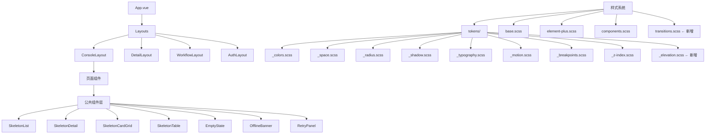

# 技术设计文档：管理员端视觉质感优化

## 概述

本设计文档覆盖 `frontend/apps/admin-app/` 的视觉表现层优化，目标是在不改变路由、状态管理、业务逻辑或 API 调用行为的前提下，系统性提升视觉质感与交互体验。

**设计原则：**
- **Token 驱动**：所有视觉属性通过 Design Token 控制，杜绝硬编码
- **渐进增强**：动画和高级视觉效果在不支持的环境下优雅降级
- **E2E 兼容**：保持现有 Playwright 测试依赖的 DOM 结构和属性不变
- **无障碍优先**：满足 WCAG AA 标准，尊重用户的 `prefers-reduced-motion` 偏好

**技术栈约束：**
- Vue 3 Composition API + `<script setup>`
- Element Plus 组件库（样式覆写，不 fork）
- Pinia 状态管理（复用现有 `useThemeStore`）
- SCSS + CSS Custom Properties（Token 系统）
- Playwright E2E（兼容性保障）

**外部库引入策略：**

在必要情况下可引入外部组件库以达到最优视觉效果，遵循以下原则：

| 用途 | 推荐库 | 引入理由 |
| --- | --- | --- |
| 过渡动画 | `@vueuse/motion` 或 `@formkit/auto-animate` | 提供声明式动画 API，减少手写 CSS transition 样板代码 |
| SVG 插图 | `@iconify/vue` | 统一图标/插图管理，支持按需加载，适合空状态和错误页插图 |
| 色彩工具 | `colord` | 轻量色彩计算库（~3KB），用于运行时 WCAG 对比度校验 |
| 响应式工具 | `@vueuse/core`（`useMediaQuery`、`useOnline`） | 提供响应式断点和网络状态检测的 composable |
| 骨架屏动画 | 自研（基于 CSS `@keyframes`） | shimmer 效果简单，无需额外依赖 |

**引入规则：**
1. 优先选择 tree-shakeable、ESM-first 的库，避免引入整包
2. 单个新增依赖的 gzip 体积不超过 15KB
3. 必须是活跃维护的项目（最近 6 个月内有发布）
4. 不引入与 Element Plus 功能重叠的 UI 框架（如 Ant Design Vue、Naive UI）
5. 所有新增依赖使用精确版本号（pinned version）

---

## 架构

### 组件层次结构



### Token 系统扩展方案

现有 Token 文件保持不变，通过扩展而非替换的方式增强：

| 维度 | 现有文件 | 扩展内容 |
| --- | --- | --- |
| 颜色 | `_colors.scss` | 新增 `--ckqa-surface-hover`、`--ckqa-border-subtle` 语义色 |
| 间距 | `_space.scss` | 迁移为 CSS Custom Properties，新增 `--ckqa-space-*` 变量 |
| 圆角 | `_radius.scss` | 已完善，无需修改 |
| 阴影 | `_shadow.scss` + `_elevation.scss` | 新增 Elevation 三级语义层（flat/raised/floating） |
| 字体 | `_typography.scss` | 新增 5 级字号层级变量（h1–h4 + body） |
| 动效 | `_motion.scss` | 更新为三级时长 + 缓动曲线 Token |
| 断点 | `_breakpoints.scss` | 保持现有值，新增 CSS Custom Properties 版本 |

---

## 组件与接口

### 骨架屏系统

基于现有 `SkeletonBlock.vue` 扩展为四种变体：

#### SkeletonList.vue

```vue
<script setup>
defineProps({
  rows: { type: Number, default: 5 },
  showAvatar: { type: Boolean, default: false },
  showActions: { type: Boolean, default: true },
})
</script>
```

用途：课程列表、知识库列表、问答会话列表等列表页加载态。

#### SkeletonDetail.vue

```vue
<script setup>
defineProps({
  sections: { type: Number, default: 3 },
  showHeader: { type: Boolean, default: true },
  showSidebar: { type: Boolean, default: false },
})
</script>
```

用途：课程详情、资料详情、知识库详情等详情页加载态。

#### SkeletonCardGrid.vue

```vue
<script setup>
defineProps({
  cards: { type: Number, default: 6 },
  columns: { type: Number, default: 3 },
})
</script>
```

用途：工作台 MetricTile 网格、卡片式列表加载态。

#### SkeletonTable.vue

```vue
<script setup>
defineProps({
  rows: { type: Number, default: 8 },
  columns: { type: Number, default: 5 },
  showHeader: { type: Boolean, default: true },
})
</script>
```

用途：DataTableShell 内表格加载态。

**共享行为：**
- 所有骨架屏组件根元素设置 `aria-hidden="true"`
- 应用 shimmer 动画（1.5s 周期，从左到右渐变闪烁）
- 通过 `<Transition name="skeleton-fade">` 包裹，加载完成后淡出（duration ≤ 300ms）

### 空状态组件

#### EmptyState.vue

```vue
<script setup>
defineProps({
  icon: { type: [String, Object], default: null },
  title: { type: String, required: true },
  description: { type: String, default: '' },
  actionLabel: { type: String, default: '' },
  actionTo: { type: [String, Object], default: '' },
})

defineEmits(['action'])
</script>
```

用途：列表页无数据时的占位展示。通过 `icon` prop 传入 lucide-vue-next 图标组件，自动适配 Light/Dark 配色。

### 断网提示组件

#### OfflineBanner.vue

```vue
<script setup>
import { ref, onMounted, onUnmounted } from 'vue'

const isOffline = ref(!navigator.onLine)
const showRecovery = ref(false)
</script>
```

用途：全局断网提示条，挂载在 App.vue 或 ConsoleLayout 顶部。

### 重试面板组件

#### RetryPanel.vue

```vue
<script setup>
defineProps({
  error: { type: [String, Object], default: '' },
  retryCount: { type: Number, default: 0 },
  maxRetries: { type: Number, default: 3 },
  loading: { type: Boolean, default: false },
})

defineEmits(['retry'])
</script>
```

用途：API 请求失败时的局部错误态展示，包含错误摘要和重试按钮。连续 3 次失败后展示升级提示。

### 过渡动画系统

新增 `src/styles/transitions.scss`，提供全局可复用的 Vue Transition 类名：

| Transition Name | 用途 | 效果 |
| --- | --- | --- |
| `page-fade` | 路由切换 | 淡入，duration = `--ckqa-duration-normal` |
| `slide-down` | 操作反馈面板 | 从上方滑入 |
| `list-stagger` | 列表项渐入 | 逐条渐入，stagger ≤ 50ms |
| `skeleton-fade` | 骨架屏替换 | 淡出，duration ≤ 300ms |
| `nav-collapse` | 侧边导航收起 | 宽度平滑过渡 |

所有过渡在 `prefers-reduced-motion: reduce` 下自动降级为 `duration: 0ms`。

---

## 数据模型

本次优化不涉及业务数据模型变更。涉及的状态模型如下：

### Theme Store 扩展

现有 `useThemeStore` 保持不变，新增以下响应式状态用于布局控制：

```javascript
// src/stores/layout.js（新增）
export const useLayoutStore = defineStore('layout', () => {
  const state = reactive({
    sidebarMode: 'full',    // 'full' | 'icon' | 'hidden'
    isMobileMenuOpen: false,
  })

  // 响应视口变化自动切换 sidebarMode
  function syncViewport(width) {
    if (width >= 1200) state.sidebarMode = 'full'
    else if (width >= 768) state.sidebarMode = 'icon'
    else state.sidebarMode = 'hidden'
  }

  return { state: readonly(state), syncViewport, toggleMobileMenu }
})
```

### 网络状态模型

```javascript
// src/composables/useNetworkStatus.js（新增）
export function useNetworkStatus() {
  const isOnline = ref(navigator.onLine)
  const wasOffline = ref(false)

  // 监听 online/offline 事件
  // 网络恢复时短暂展示成功提示

  return { isOnline, wasOffline }
}
```

### 重试状态模型

```javascript
// src/composables/useRetry.js（新增）
export function useRetry(fetchFn, options = {}) {
  const { maxRetries = 3 } = options
  const retryCount = ref(0)
  const isEscalated = ref(false)
  const loading = ref(false)
  const error = ref(null)

  async function execute() { /* ... */ }
  async function retry() { /* ... */ }

  return { retryCount, isEscalated, loading, error, execute, retry }
}
```

---

## 正确性属性

*A property is a characteristic or behavior that should hold true across all valid executions of a system—essentially, a formal statement about what the system should do. Properties serve as the bridge between human-readable specifications and machine-verifiable correctness guarantees.*

### Property 1: Accent 色板 WCAG AA 对比度

*For any* accent 色板（indigo、blue、teal、violet、amber）和任意主题模式（light、dark），accent 色与其对应的 contrast 色之间的对比度应 ≥ 4.5:1，且 accent 色作为文字色时与对应 surface 背景色的对比度应 ≥ 4.5:1。

**Validates: Requirements 1.3**

### Property 2: prefers-reduced-motion 降级

*For any* 包含 `transition` 或 `animation` 属性的 CSS 规则，在 `prefers-reduced-motion: reduce` 媒体查询激活时，所有动画的 `duration` 应降级为 ≤ 10ms（等效即时切换），确保不产生视觉运动。

**Validates: Requirements 4.5**

### Property 3: 骨架屏无障碍属性

*For any* 骨架屏组件变体（SkeletonList、SkeletonDetail、SkeletonCardGrid、SkeletonTable），其渲染输出的根元素应包含 `aria-hidden="true"` 属性，确保屏幕阅读器不会朗读占位内容。

**Validates: Requirements 5.5**

### Property 4: 状态页面主题适配

*For any* 状态页面组件（EmptyState、错误页面 403/404/500、未开放页面）在任意主题模式（light、dark）下，页面内所有文字元素与其直接背景色的对比度应 ≥ 4.5:1，且插图/图标配色应随主题模式变化。

**Validates: Requirements 6.3, 7.4**

### Property 5: E2E 关键 DOM 结构不变性

*For any* 包含 `.operation-feedback` 元素的组件实例，该元素应保持 `data-status` 属性（值为 `failed` 或 `running`）；内部应包含错误描述文本和业务码/HTTP 状态码信息。*For any* 包含 `.build-step-stage` 的组件实例，应保持类名和内部 heading 元素结构。*For any* `.module-hero` 区域内的按钮，应保持其 accessible name 不变。

**Validates: Requirements 7.5, 12.1, 12.2, 12.3, 12.4**

### Property 6: 重试升级提示逻辑

*For any* API 请求和任意连续失败次数 N，当 N ≥ 3 时 `useRetry` composable 应将 `isEscalated` 设为 `true`（触发升级提示），当 N < 3 时 `isEscalated` 应为 `false`（展示普通重试按钮）。无论 `isEscalated` 状态如何，手动重试入口始终可用。

**Validates: Requirements 8.5**

### Property 7: 未开放页面信息完整性

*For any* `status: 'upcoming'` 的路由配置，当用户访问该路由时，渲染的占位页面应包含：所属模块名称（来自 `route.meta.navGroup`）、规划状态（来自 `route.meta.status`）和路由名称（来自 `route.name` 或 `route.path`）三项信息。

**Validates: Requirements 9.2**

### Property 8: 表格响应式水平滚动

*For any* 使用 `.ckqa-el-table` 类的表格组件，当视口宽度 < 768px 时，表格容器应具有 `overflow-x: auto` 样式，确保内容可水平滚动而非被截断。

**Validates: Requirements 10.4**

### Property 9: 错误页面视觉差异化

*For any* 两个不同的错误码（403、404、500），其对应的错误页面渲染输出应包含不同的视觉标识元素（不同的 eyebrow 文案、不同的图标或插图、不同的配色强调），确保用户能通过视觉快速区分错误类型。

**Validates: Requirements 7.1**

### Property 10: 间距 Token 使用一致性

*For any* 组件样式文件中的 `margin`、`padding`、`gap` 属性声明，其值应引用 `$space-*` SCSS 变量或 `var(--ckqa-space-*)` CSS 变量，而非硬编码的像素值（允许 `0` 和 `auto` 例外）。

**Validates: Requirements 2.3**

---

## 错误处理

### 网络错误处理策略

```mermaid
flowchart TD
    A[API 请求发起] --> B{请求结果}
    B -->|成功| C[正常渲染数据]
    B -->|5xx / 超时| D[展示 RetryPanel]
    B -->|网络断开| E[展示 OfflineBanner]

    D --> F{用户点击重试}
    F --> G[重新发起请求]
    G --> H{重试结果}
    H -->|成功| C
    H -->|失败| I{retryCount >= 3?}
    I -->|是| J[展示升级提示]
    I -->|否| D

    E --> K{网络恢复}
    K --> L[隐藏 OfflineBanner]
    L --> M[展示"网络已恢复"Toast]
```

### 错误分级

| 错误类型 | 展示方式 | 恢复路径 |
| --- | --- | --- |
| 网络断开 | 顶部持久性 Banner | 自动恢复 |
| 5xx / 超时 | 局部 RetryPanel | 手动重试 |
| 连续 3 次失败 | 升级提示 | 手动重试 + 联系管理员 |
| 403 | 全页错误页 | 返回工作台 / 切换身份 |
| 404 | 全页错误页 | 返回工作台 |
| 500（路由级） | 全页错误页 | 刷新 / 系统健康 |

### E2E 兼容性保障

视觉优化过程中必须保持以下 DOM 契约不变：

1. `.operation-feedback[data-status="failed"]` — 错误面板标识
2. `.operation-feedback[data-status="running"]` — 运行中面板标识
3. `.operation-feedback` 内部文案结构（错误描述 + 业务码/HTTP 状态码）
4. `.build-step-stage` 类名及内部 heading 层级
5. `.module-hero` 区域按钮的 accessible name
6. `[data-error-status]` 属性（UnifiedErrorView）

---

## 测试策略

### Property-Based Testing

**测试库选择：** [fast-check](https://github.com/dubzzz/fast-check)（JavaScript PBT 库，与 Vitest 集成）

**配置：**
- 每个 property test 最少运行 100 次迭代
- 每个测试标注对应的 design property

**Property Tests 清单：**

| Property | 测试文件 | 生成器 |
| --- | --- | --- |
| Property 1: WCAG AA 对比度 | `src/__tests__/properties/theme-contrast.prop.test.js` | 生成 accent × mode 组合 |
| Property 2: reduced-motion 降级 | `src/__tests__/properties/motion-a11y.prop.test.js` | 生成包含动画的组件实例 |
| Property 3: 骨架屏无障碍 | `src/__tests__/properties/skeleton-a11y.prop.test.js` | 生成骨架屏变体 × props 组合 |
| Property 4: 状态页面主题适配 | `src/__tests__/properties/state-page-theme.prop.test.js` | 生成状态页面 × 主题模式组合 |
| Property 5: DOM 结构不变性 | `src/__tests__/properties/e2e-dom-contract.prop.test.js` | 生成错误状态 × 错误数据组合 |
| Property 6: 重试升级逻辑 | `src/__tests__/properties/retry-escalation.prop.test.js` | 生成随机失败次数序列 |
| Property 7: 未开放页面信息 | `src/__tests__/properties/coming-soon-info.prop.test.js` | 生成 upcoming 路由配置 |
| Property 8: 表格水平滚动 | `src/__tests__/properties/table-responsive.prop.test.js` | 生成表格列数 × 视口宽度 |
| Property 9: 错误页面差异化 | `src/__tests__/properties/error-page-diff.prop.test.js` | 生成错误码对组合 |
| Property 10: 间距 Token 一致性 | `src/__tests__/properties/space-token-usage.prop.test.js` | 静态分析样式文件 |

**Tag 格式示例：**
```javascript
// Feature: admin-app-visual-polish, Property 6: 重试升级提示逻辑
```

### Unit Tests（Example-Based）

| 测试目标 | 测试文件 | 覆盖内容 |
| --- | --- | --- |
| OfflineBanner 行为 | `src/__tests__/unit/OfflineBanner.test.js` | 断网展示、恢复隐藏、Toast 提示 |
| RetryPanel 交互 | `src/__tests__/unit/RetryPanel.test.js` | 重试按钮、loading 状态、升级提示 |
| EmptyState 渲染 | `src/__tests__/unit/EmptyState.test.js` | 各 prop 组合渲染正确 |
| useNetworkStatus | `src/__tests__/unit/useNetworkStatus.test.js` | online/offline 事件响应 |
| useRetry | `src/__tests__/unit/useRetry.test.js` | 重试计数、升级触发、重置 |
| useLayoutStore | `src/__tests__/unit/useLayoutStore.test.js` | 视口同步、模式切换 |

### E2E Tests（Playwright）

现有测试文件保持不变，新增视觉回归验证：

| 测试文件 | 验证内容 |
| --- | --- |
| `e2e/local-operation-errors.spec.js` | 保持通过（DOM 契约不变） |
| `e2e/data-table-layout.spec.js` | 保持通过（表格结构不变） |
| `e2e/visual-regression.spec.js`（新增） | 关键页面截图对比 |
| `e2e/responsive-layout.spec.js`（新增） | 三种视口断点布局验证 |

### 测试运行命令

```bash
# 单元测试 + Property 测试
pnpm test

# E2E 测试
pnpm test:e2e

# 仅运行 property 测试
pnpm vitest --run src/__tests__/properties/
```
