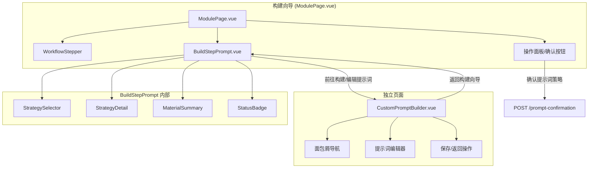
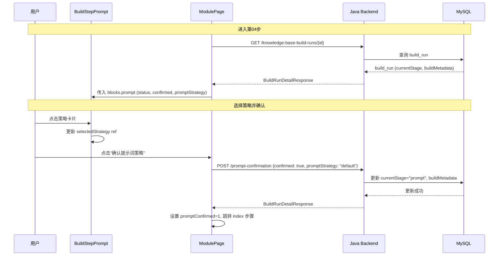
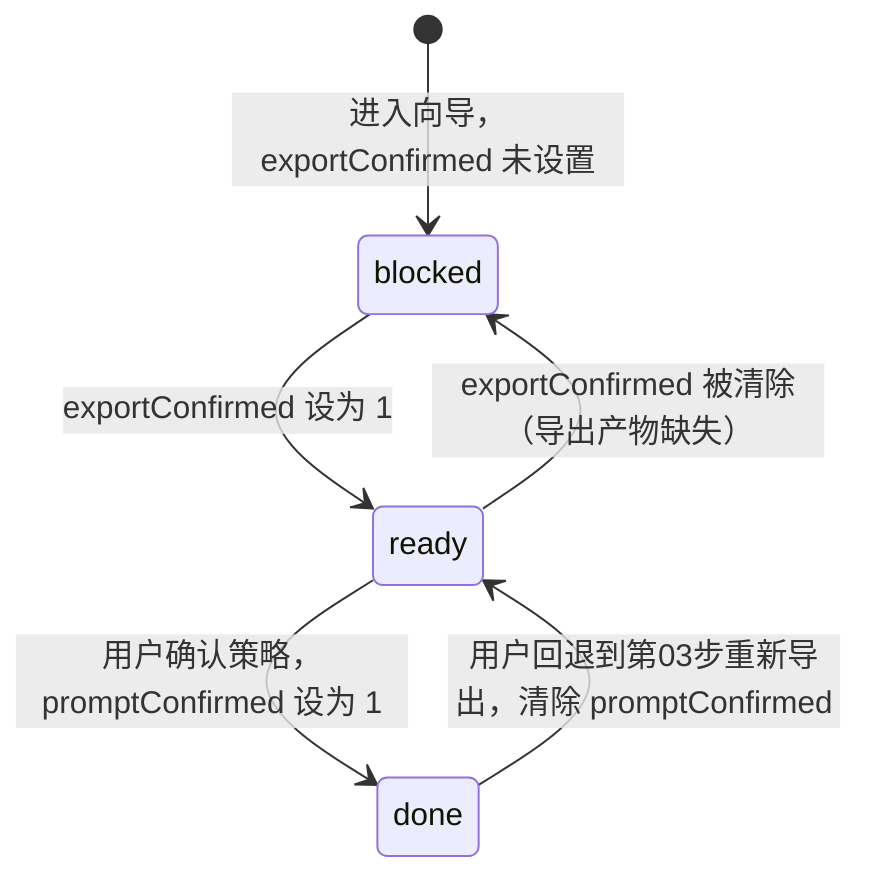

# 技术设计文档：Prompt 确认步骤

## 概述

本设计实现知识库构建向导第04步"Prompt 确认"的完整交互升级。将现有的最小占位实现（`BuildStepPrompt.vue`）升级为支持三种提示词策略选择的完整面板，包含策略卡片选择、策略详情展示、自定义提示词构建页面跳转、确认按钮交互、步骤状态联动和已确认状态回看。

### 设计目标

1. 在现有构建向导框架内实现策略选择面板，复用 `ModulePage.vue` 的操作分发机制
2. 新增独立路由页面 `Custom_Prompt_Builder`，支持自定义提示词构建
3. 扩展后端 `POST /api/v1/knowledge-base-build-runs/{id}/prompt-confirmation` 接口，支持 `promptStrategy` 字段的三种策略值
4. 保持与现有步骤状态流转机制（query 参数驱动）的一致性

### 技术栈

| 层 | 技术 | 说明 |
| --- | --- | --- |
| 前端 | Vue 3 + Vite | `frontend/apps/admin-app/` |
| 后端 | Java 21 + Spring Boot 4.0.5 | `backend/ckqa-back/` |
| 状态管理 | URL query 参数 + 组件 ref | 与现有构建向导一致 |
| UI 组件库 | Element Plus | 已在 admin-app 中使用 |

---

## 架构

### 高层组件架构



### 数据流



### 路由设计

| 路由 | 组件 | 说明 |
| --- | --- | --- |
| `/app/knowledge-bases/:kbId/build` | `ModulePage.vue` | 现有构建向导，第04步由 `BuildStepPrompt.vue` 渲染 |
| `/app/knowledge-bases/:kbId/build/prompt-builder` | `CustomPromptBuilder.vue` | 新增独立路由，自定义提示词构建页面 |

新增路由配置：

```javascript
{
  path: '/app/knowledge-bases/:kbId/build/prompt-builder',
  name: 'custom-prompt-builder',
  componentKey: 'CustomPromptBuilder',
  meta: {
    title: '提示词设计',
    layout: 'console',
    permissions: ['kb:index'],
    status: 'mvp',
    navGroup: 'knowledge',
    resource: 'knowledgeBase',
    scope: 'course',
  },
}
```

---

## 组件与接口

### 前端组件

#### 1. `BuildStepPrompt.vue`（升级）

**Props：**

```typescript
interface BuildStepPromptProps {
  blocks: {
    prompt: {
      status: 'blocked' | 'ready' | 'done'
      confirmed: boolean
      promptStrategy?: 'default' | 'graphrag_tuned' | 'custom_pipeline'
      customPromptDraft?: CustomPromptDraft | null
    }
    selection: {
      materialIds: string[]
    }
  }
}
```

**Emits：**

```typescript
interface BuildStepPromptEmits {
  'strategy-change': (strategy: PromptStrategy) => void
  'navigate-prompt-builder': () => void
}
```

**内部状态：**

```javascript
const selectedStrategy = ref('default') // 当前选中策略
const strategies = [
  { key: 'default', name: '默认提示词', description: '使用系统默认的提示词' },
  { key: 'graphrag_tuned', name: 'GraphRAG 自动调优提示词', description: '使用 GraphRAG 自动调优生成的提示词' },
  { key: 'custom_pipeline', name: '我的流水线设计提示词', description: '使用自定义的流水线设计提示词' },
]
```

#### 2. `StrategySelector.vue`（新增）

**Props：**

```typescript
interface StrategySelectorProps {
  strategies: StrategyOption[]
  modelValue: string          // 当前选中策略 key
  disabled: boolean           // blocked 状态下禁用
  readonly: boolean           // done 状态下只读
}

interface StrategyOption {
  key: string
  name: string
  description: string
}
```

**Emits：**

```typescript
interface StrategySelectorEmits {
  'update:modelValue': (key: string) => void
}
```

#### 3. `StrategyDetail.vue`（新增）

**Props：**

```typescript
interface StrategyDetailProps {
  strategy: string                        // 当前选中策略 key
  customPromptDraft: CustomPromptDraft | null
  readonly: boolean
}
```

**Emits：**

```typescript
interface StrategyDetailEmits {
  'navigate-builder': () => void          // 前往构建/编辑提示词
}
```

#### 4. `CustomPromptBuilder.vue`（新增独立页面）

**路由参数：**

```typescript
interface CustomPromptBuilderRoute {
  params: { kbId: string }
  query: { buildRunId?: string }
}
```

**内部状态：**

```javascript
const promptDraft = ref({})       // 提示词草稿数据
const isDirty = ref(false)        // 是否有未保存修改
const saveState = ref('idle')     // idle | saving | saved | error
```

**导航守卫：**

```javascript
// Vue Router beforeRouteLeave
onBeforeRouteLeave((to, from, next) => {
  if (isDirty.value) {
    // 弹出确认对话框
    ElMessageBox.confirm('有未保存的修改，确定离开吗？', '提示', {
      confirmButtonText: '确定离开',
      cancelButtonText: '继续编辑',
      type: 'warning',
    }).then(() => next()).catch(() => next(false))
  } else {
    next()
  }
})
```

### 后端接口

#### `POST /api/v1/knowledge-base-build-runs/{id}/prompt-confirmation`

**请求体（扩展）：**

```json
{
  "confirmed": true,
  "promptStrategy": "default"
}
```

`promptStrategy` 支持的值：
- `"default"` — 系统默认提示词
- `"graphrag_tuned"` — GraphRAG 自动调优提示词
- `"custom_pipeline"` — 用户自定义流水线设计提示词
- `"active"` — 向后兼容，等同于 `"default"`

**响应体：**

```json
{
  "code": 200,
  "message": "操作成功",
  "data": {
    "id": 42,
    "knowledgeBaseId": 5,
    "courseId": "crs-20260501-120000",
    "status": "running",
    "currentStage": "prompt",
    "buildMetadata": "{\"stage\":\"prompt\",\"confirmed\":true,\"promptStrategy\":\"default\"}",
    "selectedMaterialIds": "1,2,3",
    "createdAt": "2026-05-10T10:00:00",
    "updatedAt": "2026-05-10T10:05:00"
  },
  "timestamp": "2026-05-10T10:05:00"
}
```

**后端变更：**

`BuildRunPromptConfirmationRequest.java` 扩展 `promptStrategy` 字段验证：

```java
@Getter
@Setter
public class BuildRunPromptConfirmationRequest {
    @Pattern(regexp = "^(default|graphrag_tuned|custom_pipeline|active)$",
             message = "promptStrategy 必须为 default、graphrag_tuned、custom_pipeline 或 active")
    private String promptStrategy = "default";

    private Boolean confirmed = false;
}
```

`KnowledgeBaseBuildRunService.confirmPrompt()` 逻辑保持不变，已正确将 `promptStrategy` 写入 `buildMetadata`。

#### `GET /api/v1/knowledge-base-build-runs/{id}`

响应中 `buildMetadata` JSON 字段包含 `promptStrategy`，前端据此恢复策略选中状态。

---

## 数据模型

### 前端状态模型

```typescript
// 策略类型
type PromptStrategy = 'default' | 'graphrag_tuned' | 'custom_pipeline'

// 自定义提示词草稿
interface CustomPromptDraft {
  id?: number
  buildRunId: number
  content: string           // 提示词内容
  savedAt?: string          // 最后保存时间
  summary?: string          // 摘要（前端截取前 100 字符）
}

// Prompt 步骤 block 数据（由 module-loaders.js 构造）
interface PromptBlock {
  status: 'blocked' | 'ready' | 'done'
  confirmed: boolean
  promptStrategy: PromptStrategy
  customPromptDraft: CustomPromptDraft | null
  shouldCleanPromptConfirmed: boolean
}
```

### 后端数据模型

现有 `knowledge_base_build_runs` 表无需新增字段。`promptStrategy` 存储在 `build_metadata` JSON 字段中：

```json
{
  "stage": "prompt",
  "confirmed": true,
  "promptStrategy": "default"
}
```

自定义提示词草稿暂存于 `build_metadata` 中的 `customPromptDraft` 子对象，首版不新增独立表：

```json
{
  "stage": "prompt",
  "confirmed": true,
  "promptStrategy": "custom_pipeline",
  "customPromptDraft": {
    "content": "...",
    "savedAt": "2026-05-10T10:00:00"
  }
}
```

### 状态流转



---

## 正确性属性

*属性是在系统所有有效执行中都应成立的特征或行为——本质上是关于系统应该做什么的形式化陈述。属性是人类可读规格说明与机器可验证正确性保证之间的桥梁。*

### Property 1: Prompt 步骤状态解析正确性

*对于任意* query 对象和 export 状态组合，`resolvePromptConfirmState(query, exportState)` 的返回值必须满足：
- 若 export 未完成（`exportConfirmed` 不为 `'1'`），则 status 为 `'blocked'`
- 若 export 已完成且 `promptConfirmed` 不为 `'1'`，则 status 为 `'ready'`
- 若 export 已完成且 `promptConfirmed` 为 `'1'`，则 status 为 `'done'`

**Validates: Requirements 5.1, 5.2, 5.3**

### Property 2: 步骤依赖不变量

*对于任意* 构建向导步骤状态数组，若第04步（prompt）的 status 不为 `'done'`，则第05步（index）的 status 必须为 `'blocked'`。即：只有 prompt 步骤完成后，index 步骤才能解除阻塞。

**Validates: Requirements 5.5, 5.6**

### Property 3: currentStage 到步骤状态的映射正确性

*对于任意* 有效的 `currentStage` 值，步骤状态恢复逻辑必须满足：
- 若 `currentStage` 在 `['prompt', 'index', 'index_build', 'qa_smoke', 'done']` 中，则第04步恢复为 `'done'`
- 若 `currentStage` 在 `['material_selection', 'parse', 'parse_check', 'graph_input', 'graph_input_export']` 中，则第04步为非 `'done'` 状态（`'blocked'` 或 `'ready'`，取决于前置步骤）

**Validates: Requirements 6.2, 6.3**

---

## 错误处理

### 前端错误处理

| 场景 | 处理方式 |
| --- | --- |
| API 返回业务错误（4xx） | 在操作面板展示 `response.message` 字段内容，按钮恢复可点击 |
| 网络超时（15秒） | 展示"网络异常，请检查连接后重试"，按钮恢复可点击 |
| 网络连接失败 | 展示"网络连接失败，请稍后重试"，按钮恢复可点击 |
| 选中 custom_pipeline 但未构建 | 确认按钮禁用，下方展示"请先完成自定义提示词构建" |
| Custom_Prompt_Builder 保存失败 | 展示保存失败提示，保留编辑内容不丢失 |

### 后端错误处理

| 场景 | HTTP 状态码 | 响应 |
| --- | --- | --- |
| build_run 不存在 | 404 | `{ code: 404, message: "构建流水线不存在" }` |
| promptStrategy 值非法 | 400 | `{ code: 400, message: "promptStrategy 必须为 default、graphrag_tuned、custom_pipeline 或 active" }` |
| build_run 已归档 | 409 | `{ code: 409, message: "构建流水线已归档，不可操作" }` |

---

## 测试策略

### 单元测试

| 测试目标 | 文件 | 框架 |
| --- | --- | --- |
| `resolvePromptConfirmState` 状态解析 | `module-content.test.js` | Vitest |
| `resolvePromptPrimaryAction` 按钮状态 | `module-content.test.js` | Vitest |
| `StrategySelector` 组件渲染与交互 | `StrategySelector.test.js` | Vitest + @vue/test-utils |
| `StrategyDetail` 条件渲染 | `StrategyDetail.test.js` | Vitest + @vue/test-utils |
| `BuildStepPrompt` 集成渲染 | `BuildStepPrompt.test.js` | Vitest + @vue/test-utils |
| 后端 `confirmPrompt` 服务方法 | `KnowledgeBaseBuildRunServiceTest.java` | JUnit 5 + Mockito |

### 属性测试

| 属性 | 测试文件 | 库 |
| --- | --- | --- |
| Property 1: 状态解析正确性 | `prompt-state-resolution.property.test.js` | fast-check + Vitest |
| Property 2: 步骤依赖不变量 | `step-dependency.property.test.js` | fast-check + Vitest |
| Property 3: Stage 映射正确性 | `stage-mapping.property.test.js` | fast-check + Vitest |

**属性测试配置：**
- 每个属性测试最少运行 100 次迭代
- 使用 fast-check 生成随机 query 对象和 currentStage 值
- 每个测试标注对应的设计属性编号

**标注格式示例：**
```javascript
// Feature: prompt-confirmation-step, Property 1: Prompt 步骤状态解析正确性
test.prop('resolvePromptConfirmState returns correct status for any query/export combination', ...)
```

### E2E 测试

| 场景 | 文件 | 框架 |
| --- | --- | --- |
| 策略选择完整流程 | `prompt-confirmation.spec.ts` | Playwright |
| Custom_Prompt_Builder 导航与保存 | `custom-prompt-builder.spec.ts` | Playwright |
| 错误处理与恢复 | `prompt-confirmation-errors.spec.ts` | Playwright |

### 后端集成测试

| 场景 | 文件 | 框架 |
| --- | --- | --- |
| prompt-confirmation API 正常流程 | `BuildRunPromptConfirmationTest.java` | Spring Boot Test + MockMvc |
| promptStrategy 参数校验 | `BuildRunPromptConfirmationTest.java` | Spring Boot Test + MockMvc |
| currentStage 更新验证 | `BuildRunPromptConfirmationTest.java` | Spring Boot Test + MockMvc |
