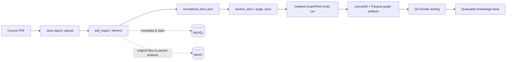
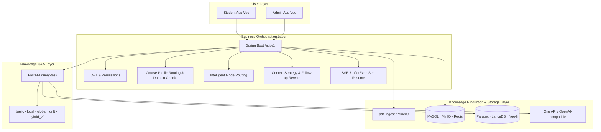
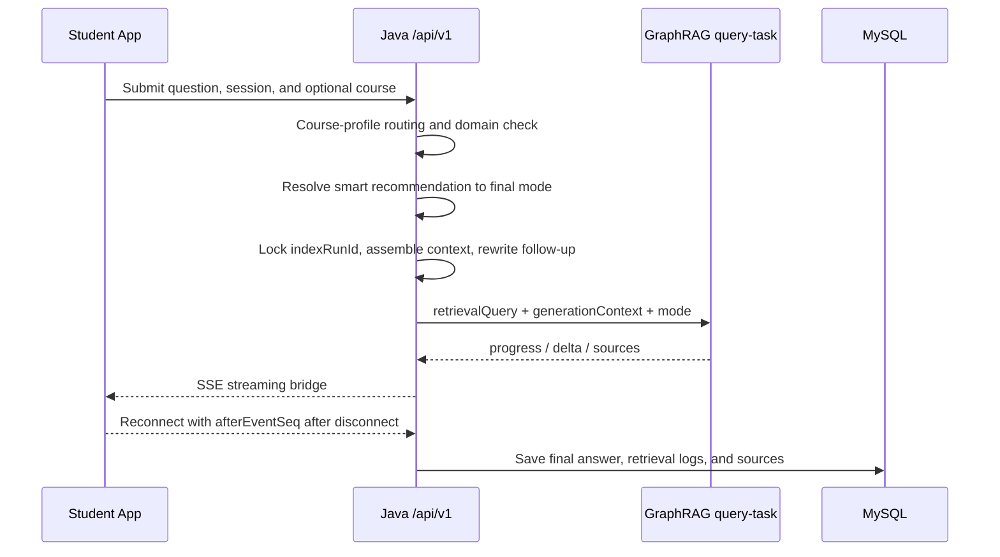
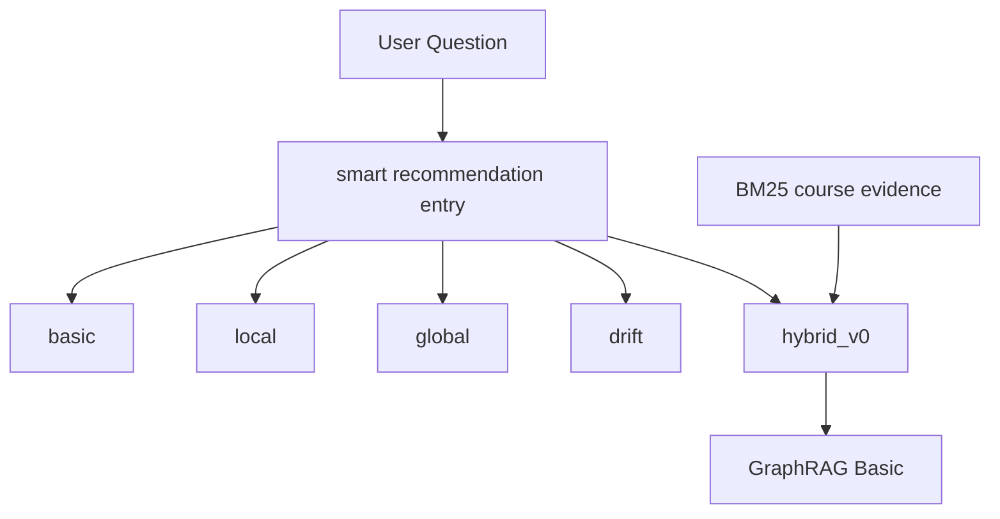

# CKQA · Course Knowledge Graph Q&A Platform

[简体中文](README.md) | [Documentation](#documentation) | [Quick start](#quick-start)

CKQA (Course Knowledge Question Answering) is a course-material knowledge production and question-answering platform. It turns course PDFs into traceable normalized text, builds course knowledge-graph indexes powered by Microsoft GraphRAG, and exposes course Q&A, knowledge-base builds, and operations through student, admin, and Java API applications.

> The v1 baseline is complete: PDF processing, course-material management, knowledge-base builds, GraphRAG Q&A, asynchronous streaming tasks, and the core student/admin workflows can be integrated locally. The project is still evolving; out-of-scope pages and capabilities are explicitly labelled in the UI and module documentation.

## Product Preview


*Student app using Basic mode to ask "Please define deadlock and explain the four necessary conditions for deadlock to occur," showing retrieval progress, streamed answer, and expandable page-level source citations.*

The student app issues questions against selected courses and active indexes. Java handles course and mode orchestration, then bridges Python GraphRAG's retrieval progress, answer deltas, and source events to the browser.

## Why Not Traditional Document RAG

| Dimension | Traditional Document RAG | CKQA Knowledge-Graph Q&A |
| --- | --- | --- |
| **Data source** | Raw PDF text chunks, usually lacking page/section structure | MinerU parsing + normalized export, preserving page numbers, sections, and layout |
| **Knowledge production** | Direct chunking + vectorization | Isolated GraphRAG build runs extracting entities, relations, communities, and community reports |
| **Retrieval approach** | Single vector retrieval or BM25 | Five modes (`basic` / `local` / `global` / `drift` / `hybrid_v0`) selected by question type |
| **Context understanding** | Requests are usually handled as single-turn questions | Sessions lock indexes, maintain recent context / rolling summaries / semantic topic stacks, and separate retrieval queries from generation context for follow-ups |
| **System boundary** | Usually Python monolith or LangChain app | Java `/api/v1` orchestrates auth, course routing, mode recommendation, and SSE streaming bridge |
| **Traceability** | Retrieved chunks usually text-only, hard to locate in source | Page-level and section-level sources; admin can manually review retrieval logs and sources |
| **Operations** | Index rebuilds usually overwrite global state | Isolated index artifacts, logs, and QA smoke snapshots by course and build batch |

CKQA is not superior in all scenarios: for single-document quick Q&A or tasks without multi-hop reasoning, simple vector retrieval may suffice. But for educational scenarios requiring cross-chapter reasoning, community summaries, and course-level knowledge organization, GraphRAG's structured knowledge production and multi-mode queries deliver better answer quality and explainability.

## Project Highlights

- **Complete knowledge production pipeline**: From course PDF upload, MinerU parsing, normalized export to GraphRAG indexing and QA Smoke (smoke testing) validation
- **GraphRAG multi-mode Q&A**: Supports basic, local, global, drift, and hybrid_v0, adapting to factual Q&A, cross-chapter summaries, and course-level knowledge organization
- **Context-aware Q&A core**: Sessions lock active indexes and combine recent dialogue, rolling summaries, semantic topic stacks, and follow-up rewriting to reduce multi-turn drift
- **Course profiles and intelligent routing**: Course metadata, knowledge bases, material titles, and GraphRAG hints form derived course profiles for course recommendation, domain checks, and mode routing
- **Java orchestration boundary**: Frontend uniformly accesses Java `/api/v1`; Java handles auth, course routing, mode recommendation, async tasks, and SSE streaming bridge
- **Observable operations loop**: Admin app supports material parsing progress, build wizards, Q&A logs, source reviews, and system health checks

## Core Capabilities

| Capability | What it does |
| --- | --- |
| Course material processing | Uploads PDFs, invokes MinerU, records page-level progress, and stores objects and metadata in MinIO and MySQL. |
| Normalized exports | Produces `normalized_docs.json` for review and `section_docs.json` / `page_docs.json` for graph construction. |
| Knowledge-base builds | Isolates GraphRAG inputs, outputs, logs, and QA Smoke (smoke testing) snapshots by course and build run. |
| Course Q&A | Supports `basic`, `local`, `global`, `drift`, and `hybrid_v0`, with retrieval progress, streamed answers, and sources in the student app. |
| Context management | Locks `indexRunId` for formal sessions and builds recent context, rolling summaries, semantic topic stacks, and follow-up rewrites by strategy. |
| Service orchestration | Java `/api/v1` handles auth, course-profile routing, domain checks, mode recommendation, asynchronous QA, SSE resume, and admin operations. |
| Operational visibility | The admin app covers courses, materials, parsing progress, build wizards, QA Smoke (smoke testing), retrieval logs, source reviews, and health checks. |

## Knowledge Production Pipeline



## Architecture



Java `/api/v1` is the formal browser boundary. The Python GraphRAG service is orchestrated internally by Java; browser clients do not call Python `/v1` endpoints directly.

## Q&A Flow



## Intelligent Q&A Design

CKQA does not simply forward a browser question to GraphRAG. Before Java creates a Python query task, it makes a set of explainable decisions so course selection, context, retrieval mode, and observability all stay inside one business workflow.

### Context Management

- Formal QA sessions lock the active `indexRunId`, so one conversation does not mix indexes when a new build is activated in the background.
- Context strategies include `none`, `recent`, `summary`, and `summary_recent`: recent messages handle short follow-ups, while rolling summaries and the semantic topic stack preserve longer-running topics.
- The system separates the user's original question into a retrieval-oriented `retrievalQuery` and generation-oriented `generationContext`. Follow-ups such as "what are its four conditions?" are resolved before bounded context is passed to GraphRAG.
- Learning memory is an opt-in Beta capability used only as an appropriate cross-dialogue hint; course facts remain grounded in MySQL, MinIO, and GraphRAG indexes.

### Course Profiles and Routing

- Each queryable course has an internal derived profile built from course name, description, difficulty, tags, learning objectives, knowledge-base descriptions, document titles, material names, and hints extracted from GraphRAG artifacts.
- Profile text is embedded into the course-routing LanceDB table. When no course is explicitly selected, Java first filters courses the student can read, then asks the internal router for `matched`, `needs_confirmation`, or `no_match`.
- Course profiles also power domain checks after a course is selected, preventing clearly off-topic questions from being forced into the course knowledge base.

### Intelligent Mode Routing

Student-app `smart` is a recommendation entrypoint, not a final retrieval mode. Routing currently has three layers:

1. **Course routing**: recommend candidate courses from profiles when no course is selected.
2. **Course domain check**: decide whether the question belongs in the selected course knowledge base.
3. **Mode recommendation**: map definition, material lookup, summary, relation expansion, evidence-seeking, and follow-up signals to a final mode.

| Final mode | Best fit | Technical meaning |
| --- | --- | --- |
| `basic` | Concepts, definitions, basic facts | Lightweight GraphRAG Basic query for direct answers. |
| `local` | Details in a chapter, page, or material | Precise retrieval over local entities, text units, and source evidence. |
| `global` | Course-wide frameworks and chapter-level summaries | Uses community reports for global synthesis. |
| `drift` | Relations, causes, impacts, and cross-topic expansion | Starts from local hits and drifts across related graph evidence for multi-hop explanation. |
| `hybrid_v0` | Evidence-heavy questions that need source comparison or relation proof | Selects low-level BM25 course evidence before injecting it into GraphRAG Basic; this is a CKQA business mode, not an OpenAI model name. |

### Observable Loop

- SSE events carry increasing sequence numbers, so the student app can resume progress, answer deltas, and source events with `afterEventSeq`; polling remains as a compatibility fallback.
- Each QA run records the original question, rewritten question, context strategy, route scores, topic stack, Python task state, retrieved sources, and final answer. Admin users can review source quality.
- Routing evaluation examples, QA Smoke, retrieval logs, and manual source annotations form the quality loop: validate whether a build is queryable before activation, then inspect whether real questions are routed and cited correctly after release.

## Query Modes



`smart` is not a final query mode but an orchestration entry that recommends `basic` / `local` / `global` / `drift` or `hybrid_v0` based on question characteristics. `hybrid_v0` is a business query mode, not an OpenAI-compatible `model` name; it injects BM25 course evidence before GraphRAG Basic.

## Admin Capabilities


*Operating Systems course material detail page, showing course cover, description, instructors, and basic info. Supports viewing material parsing status, normalized export artifacts, and knowledge-base build entry.*

The admin app provides a complete operations loop around courses, materials, knowledge bases, and build batches:

- **Course and material management**: Create courses, upload PDFs, view parsing progress and normalized export artifacts
- **Knowledge-base build wizard**: Select materials, configure build params, execute GraphRAG indexing, view graph statistics
- **QA Smoke (smoke testing)**: Validate Q&A availability with built-in test sets before activating the index
- **Q&A logs and source review**: View student Q&A records, retrieval traces, retrieved sources, and manual annotations


*Knowledge-base build wizard index step completed, showing graph statistics (3776 entities, 9345 relations, 930 communities), build duration, and QA Smoke validation results.*

## Demo Walkthrough

Complete demonstration path:

1. **Upload and parse**: Admin uploads course PDF, system invokes MinerU and records page-level progress
2. **Normalized export**: Generates `normalized_docs.json` for manual review and `section_docs.json` / `page_docs.json` for downstream graph construction
3. **Isolated build**: Creates independent GraphRAG workspace by course and build batch, avoiding cross-index pollution
4. **QA Smoke (smoke testing)**: Validates entity, relation, and community report quality with built-in test sets before activating the index
5. **Student Q&A**: Student app selects course and asks questions, viewing retrieval progress, streamed answer, and source citations
6. **Source review**: Admin views Q&A logs, retrieval traces, retrieved sources, and manual accuracy annotations

## Demo Data and Reproduction

The three screenshots in this README are from the current repository's real running state:

- **Course**: Operating Systems 2026 Spring (Computer Operating Systems textbook, 408 pages)
- **Index**: GraphRAG 3.0.9, auto-tuned Prompt, 3776 entities / 9345 relations / 930 communities
- **Q&A**: Student app Basic mode, real LLM answer with GraphRAG retrieval sources

Reproduce the Q&A scenario in the screenshots locally:

```bash
# Assumes infrastructure, Python environments, backend, and frontend started per Quick Start

# 1. Restore demo data (if local database is empty)
#    See docs/superpowers/plans/2026-06-21-readme-showcase-refresh.md Task 1

# 2. Start services
cd backend/ckqa-back && scripts/run_local_backend.sh --mailer-type log
cd frontend/apps/admin-app && pnpm dev:local  # 5173
cd frontend/apps/student-app && pnpm dev:local  # 5174

# 3. Visit student app and ask
#    http://127.0.0.1:5174/qa/ask?courseId=<your-course-id>&mode=basic
#    "Please define deadlock and explain the four necessary conditions for deadlock to occur."

# 4. View admin build completed state
#    http://127.0.0.1:5173/app/knowledge-bases/<kb-id>/build?buildRunId=<build-run-id>&step=index
```

## Tech stack

- Python 3.10+: PDF processing, FastAPI, Microsoft GraphRAG `3.0.9`
- Java 21: Spring Boot `4.0.5`, MyBatis-Plus
- Vue 3 + Vite: Element Plus, Pinia, Vue Router, Sass
- MySQL, MinIO, Redis, Neo4j (optional graph browsing), and a One API/OpenAI-compatible model provider
- Docker Compose for local infrastructure

## Quick start

A complete installation needs valid MinerU and OpenAI-compatible model-provider credentials. Keep local secrets only in module `.env` files and never commit them.

### Prerequisites

- Docker and Docker Compose
- Python/Conda; separate `courseKg` and `graphrag-oneapi` environments are recommended
- JDK 21
- Node.js `^20.19.0 || >=22.12.0` and pnpm

### 1. Clone and start infrastructure

```bash
git clone <your-fork-or-repository-url> ckqa
cd ckqa

cp infra/.env.example infra/.env
# Edit infra/.env for your local MySQL, MinIO, and model-proxy settings.
docker compose --env-file infra/.env -f infra/docker-compose.yml up -d
docker compose --env-file infra/.env -f infra/docker-compose.yml ps
```

The stack includes MySQL, MinIO, One API, Neo4j, and Redis. Read [infra/README.md](infra/README.md) for ports, data-retention details, and safety notes.

### 2. Prepare the Python pipeline

```bash
cd pdf_ingest
conda activate courseKg
pip install -e ".[dev]"

cd ../graphrag_pipeline
conda activate graphrag-oneapi
pip install -e ".[all]"
pip install pytest
```

After configuring `pdf_ingest/.env` and `graphrag_pipeline/.env`, validate the production path in this order:

```bash
# From pdf_ingest/
python scripts/pdf_processor/mineru_parser.py upload <course_id> -f <course.pdf> --parse
python scripts/pdf_processor/mineru_parser.py export-graphrag <course_id> --material-id <material_id> --mode section --with-page-docs

# From graphrag_pipeline/
python utils/fetch_from_minio.py <course_id> --material-id <material_id> --clean
graphrag index --root .
python utils/main.py
```

See the [PDF Ingest guide](pdf_ingest/README.md) and [GraphRAG Pipeline guide](graphrag_pipeline/README.md) for parameters, data contracts, and validation procedures.

### 3. Start backend and web applications

```bash
# Terminal 1: configure backend/ckqa-back/.env, then start Java orchestration
cd backend/ckqa-back
scripts/run_local_backend.sh --mailer-type log

# Terminal 2: admin application
pnpm --dir ../../frontend/apps/admin-app install
pnpm --dir ../../frontend/apps/admin-app dev:local

# Terminal 3: student application
pnpm --dir ../../frontend/apps/student-app install
pnpm --dir ../../frontend/apps/student-app dev:local
```

The backend can manage the GraphRAG API with `GRAPHRAG_API_MANAGED_ENABLED=true`, or you can run `graphrag_pipeline/utils/main.py` separately. See the [backend README](backend/ckqa-back/README.md) for configuration, health checks, and complete integration steps.

Default local URLs: admin `http://127.0.0.1:5173`, student `http://127.0.0.1:5174`, backend `http://127.0.0.1:8080`, GraphRAG API `http://127.0.0.1:8012`.

### 4. Verify

```bash
# Infrastructure and Java service
curl http://127.0.0.1:8080/api/v1/system/health

# Module regression suites
cd pdf_ingest && python -m pytest tests/
cd ../graphrag_pipeline && python -m pytest tests/
cd ../frontend/apps/admin-app && pnpm test && pnpm build
cd ../../../backend/ckqa-back && ./mvnw test

# Active-document and entrypoint drift audit, from repository root
cd ../..
python scripts/audit_repo_drift.py --strict
```

Tests depend on local external services, model credentials, and existing indexes. When a check fails, confirm the module environment first instead of modifying generated runtime artifacts.

## Repository map

| Path | Responsibility | Entry documentation |
| --- | --- | --- |
| `pdf_ingest/` | PDF parsing, cleaning, normalization, and GraphRAG exports | [README](pdf_ingest/README.md) |
| `graphrag_pipeline/` | Input synchronization, indexing, GraphRAG queries, and internal task service | [README](graphrag_pipeline/README.md) |
| `backend/ckqa-back/` | Java orchestration and the browser API boundary | [README](backend/ckqa-back/README.md) |
| `frontend/apps/student-app/` | Student course and Q&A experience | [README](frontend/apps/student-app/README.md) |
| `frontend/apps/admin-app/` | Course, build, and QA operations console for administrators and teachers | [README](frontend/apps/admin-app/README.md) |
| `infra/` | Compose stack for MySQL, MinIO, One API, Neo4j, and Redis | [README](infra/README.md) |
| `sql/` | MySQL initialization baseline and incremental migrations | [ocqa.sql](sql/ocqa.sql) |

## Documentation

| Audience or task | Recommended entrypoint |
| --- | --- |
| Learn the product and run the project | This page or the [Chinese README](README.md) |
| Change PDF parsing, exports, or the course-material model | [pdf_ingest/README.md](pdf_ingest/README.md), [pdf_ingest/CLAUDE.md](pdf_ingest/CLAUDE.md) |
| Change indexing, retrieval, prompts, or the GraphRAG API | [graphrag_pipeline/README.md](graphrag_pipeline/README.md), [graphrag_pipeline/CLAUDE.md](graphrag_pipeline/CLAUDE.md) |
| Work across student app, Java backend, and GraphRAG | [Student API contract](docs/student-backend-graphrag-api-contract.md) |
| Change admin workflows or QA operations | [admin-app README](frontend/apps/admin-app/README.md) |
| Contribute with a coding agent | [AGENTS.md](AGENTS.md), [.codex](.codex) |
| Audit normalized exports | [Normalized export validation](docs/标准化导出验证说明.md) |

## Contribution conventions

- New browser-facing business APIs must go through Java `/api/v1`; do not connect frontend code directly to internal Python GraphRAG endpoints.
- Changes to `normalized_docs.json`, GraphRAG metadata, MinIO paths, or material naming must be checked against both `pdf_ingest` and `graphrag_pipeline` contracts.
- Do not commit `.env` files, index outputs, caches, runtime directories, `node_modules`, or data containing real credentials.
- Run `python scripts/audit_repo_drift.py --strict` after changing active entry docs, runtime defaults, or the GraphRAG version baseline.

## Current boundaries

- `hybrid_v0` is an internal Java business mode that injects BM25 evidence into GraphRAG Basic; it is not an OpenAI-compatible model name.
- `smart` is only the student-app recommendation entrypoint. It resolves to `basic`, `local`, `global`, `drift`, or `hybrid_v0` before a query runs.
- Learning content, community features, global search, fine-grained RBAC editing, and comprehensive audit analytics are outside the v1 scope and are explicitly marked as unavailable rather than presented as working functionality.
- MySQL, MinIO, and GraphRAG indexes have distinct responsibilities. Redis and derived graph artifacts are not the sole source of truth for course or Q&A business facts.

Issues and pull requests are welcome for course-material processing, GraphRAG retrieval quality, and product-experience improvements.
