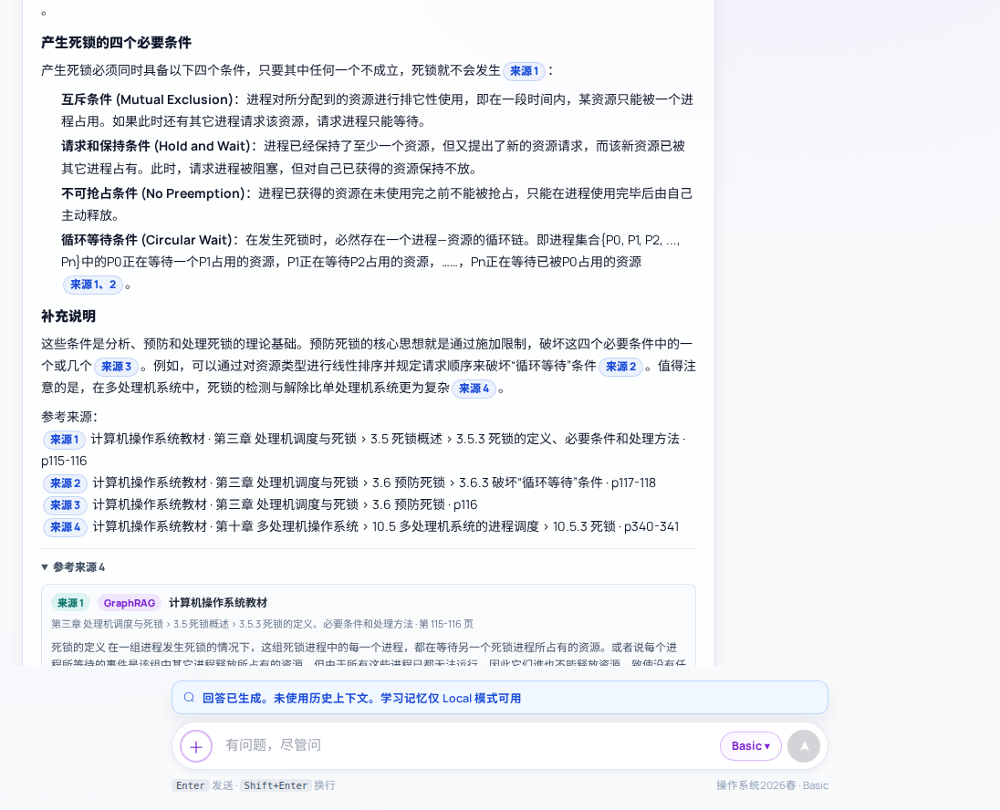
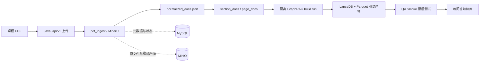
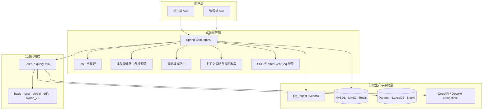
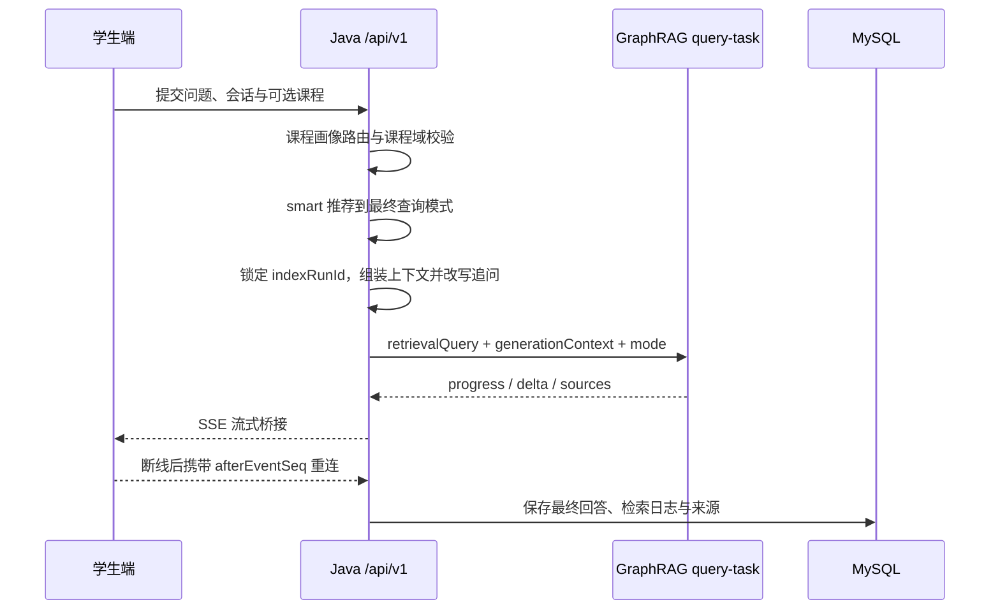
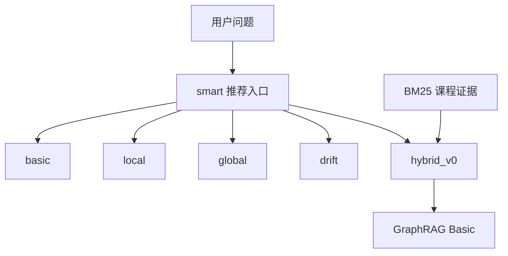
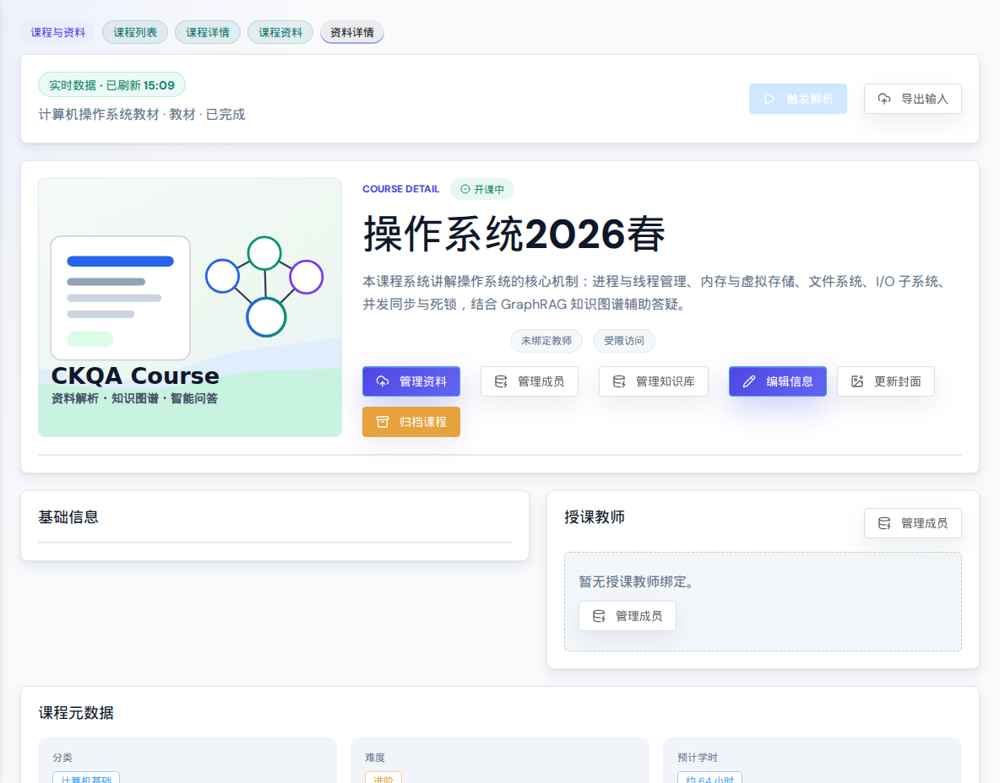
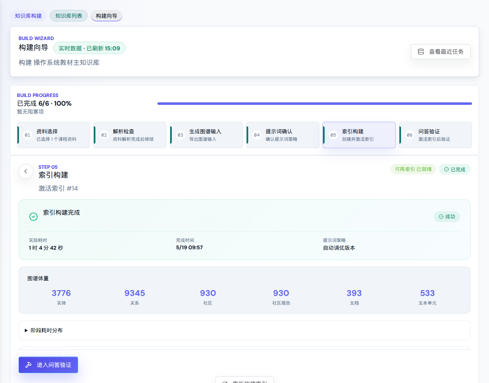

# CKQA · 课程知识图谱问答平台

[English](README.en.md) | [开发文档](#开发文档) | [快速开始](#快速开始)

CKQA（Course Knowledge Question Answering）是一套面向课程资料的知识生产与问答平台。它将课程 PDF 解析为可追溯的标准化文本，构建基于 Microsoft GraphRAG 的课程知识图谱索引，并通过学生端、管理端和 Java API 提供课程问答、知识库构建与运维能力。

> 一期基线已经完成：PDF 解析、课程资料管理、知识库构建、GraphRAG 问答、异步流式任务、学生端与管理端的核心业务闭环均可在本地联调。项目仍持续演进；未开放的页面和能力会在界面与模块文档中明确标注。

## 产品预览



*学生端 Basic 模式下提问"请给出死锁的定义，并说明产生死锁必须满足的四个条件"，展示检索进度、流式回答和可展开的页级来源引用。*

学生端围绕已选课程和已激活索引发起问答，Java 统一完成课程与模式编排，再把 Python GraphRAG 的检索进度、回答增量和来源事件桥接到浏览器。

## 为什么不是传统文档 RAG

| 维度 | 传统文档 RAG | CKQA 知识图谱问答 |
| --- | --- | --- |
| **数据源** | 原始 PDF 文本块，通常缺少页级、段落级结构 | MinerU 解析 + 标准化导出，保留页码、章节与版式信息 |
| **知识生产** | 直接切块 + 向量化 | 隔离的 GraphRAG build run，提取实体、关系、社区并生成社区报告 |
| **检索方式** | 单一向量检索或 BM25 | `basic` / `local` / `global` / `drift` / `hybrid_v0` 五种模式，根据问题类型选择 |
| **上下文理解** | 多数请求按单轮问题处理 | 会话锁定索引、维护近期上下文/滚动摘要/语义主题栈，并在追问时区分检索问题与生成上下文 |
| **系统边界** | 通常 Python 单体或 LangChain 应用 | Java `/api/v1` 统一编排认证、课程路由、模式推荐与 SSE 流式桥接 |
| **可追溯性** | 召回片段通常只有文本，难以定位原文 | 页级与章节级来源，管理端可人工复核检索日志与来源 |
| **运维** | 索引重建通常覆盖全局 | 按课程和构建批次隔离索引产物、日志与 QA smoke 快照 |

CKQA 并非在所有场景都优于传统 RAG：对于单文档快速问答或不需要多跳推理的场景，简单的向量检索可能已足够。但对于需要跨章节推理、社区摘要和课程级知识组织的教育场景，GraphRAG 的结构化知识生产与多模式查询提供了更好的答案质量与可解释性。

## 项目亮点

- **完整知识生产链路**：从课程 PDF 上传、MinerU 解析、标准化导出到 GraphRAG 建图与 QA Smoke（问答冒烟测试）验证
- **GraphRAG 多模式问答**：支持 basic、local、global、drift 与 hybrid_v0，适配事实问答、跨章节总结和课程级知识组织
- **上下文感知问答内核**：会话锁定激活索引，组合近期对话、滚动摘要、语义主题栈与追问改写，减少多轮问答漂移
- **课程画像与智能路由**：从课程元数据、知识库、资料标题和 GraphRAG hints 生成课程画像，支撑未选课推荐、课程域校验与模式推荐
- **Java 业务编排边界**：前端统一访问 Java `/api/v1`，由 Java 承接认证、课程路由、模式推荐、异步任务和 SSE 流式桥接
- **可观测运维闭环**：管理端支持资料解析进度、构建向导、问答日志、来源复核和系统健康检查

## 核心能力

| 能力 | 说明 |
| --- | --- |
| 课程资料处理 | 上传 PDF、调用 MinerU 解析、记录页级进度，并将原文件和元数据分别保存到 MinIO 与 MySQL。 |
| 标准化导出 | 生成 `normalized_docs.json` 供人工验收，并生成 `section_docs.json` / `page_docs.json` 供下游建图。 |
| 知识库构建 | 按课程和构建批次隔离 GraphRAG 输入、输出、日志与 QA Smoke（问答冒烟测试）快照，避免不同索引相互污染。 |
| 课程问答 | 支持 `basic`、`local`、`global`、`drift` 与 `hybrid_v0`；学生端可查看检索进度、流式回答和来源。 |
| 上下文管理 | 为正式会话锁定 `indexRunId`，按策略生成近期上下文、滚动摘要、语义主题栈与追问改写结果。 |
| 智能编排 | Java `/api/v1` 统一承接认证、课程画像路由、课程域校验、模式推荐、异步 QA、SSE 断线恢复及管理端运维接口。 |
| 可观测运维 | 管理端提供课程、资料、解析进度、构建向导、QA Smoke（问答冒烟测试）、问答检索日志、来源人工复核和系统健康检查。 |

## 知识生产链路



## 架构概览



浏览器正式边界始终是 Java `/api/v1`。Python GraphRAG 服务提供内部查询与构建能力，由 Java 编排；前端不直接调用 Python `/v1` 接口。

## 问答链路



## 智能问答设计

CKQA 的问答链路不是“把问题转发给 GraphRAG”。Java 在创建 Python query-task 前会完成一组可解释的决策，让课程选择、上下文、检索模式和可观测日志都落在同一条业务链路上。

### 上下文管理

- 正式 QA 会话会锁定当前激活的 `indexRunId`，同一轮对话不会因为后台新构建被激活而混用不同索引。
- 上下文策略支持 `none`、`recent`、`summary`、`summary_recent`：近期消息用于短距离追问，滚动摘要和语义主题栈用于跨轮主题延续。
- 系统会把用户原问题拆成面向检索的 `retrievalQuery` 与面向生成的 `generationContext`。例如“它的四个条件是什么”这类追问会优先补全指代，再把有限上下文传给 GraphRAG。
- 学习记忆是用户可控的 Beta 能力，只在合适模式下作为跨对话提示补充；课程事实仍以 MySQL、MinIO 和 GraphRAG 索引为准。

### 课程画像与课程路由

- 每门可问答课程会生成内部课程画像：课程名称、简介、难度、标签、教学目标、知识库描述、文档标题、资料名称，以及从 GraphRAG 产物中抽取的 hints。
- 画像文本经向量化后保存到课程路由 LanceDB 表，Java 在未显式选课时先筛选学生可读课程，再调用内部路由能力给出 `matched`、`needs_confirmation` 或 `no_match`。
- 课程画像也服务于课程域校验：选定课程后，系统会判断问题是否属于该课程语义范围，避免把明显跑题的问题强行送入课程知识库。

### 模式智能路由

学生端的 `smart` 是推荐入口，不是最终检索模式。当前路由分三层：

1. **课程路由**：没有明确课程时，先根据课程画像推荐候选课程。
2. **课程域校验**：已有课程后，判断问题是否适合进入该课程知识库。
3. **模式推荐**：根据定义、资料定位、总结、关系扩展、证据需求和追问特征，将问题落到具体模式。

| 最终模式 | 适合的问题 | 技术含义 |
| --- | --- | --- |
| `basic` | 概念、定义、基础事实 | 轻量 GraphRAG Basic 查询，适合直接回答。 |
| `local` | 某章、某页、某个材料中的细节 | 面向局部实体、文本单元和来源证据的精确检索。 |
| `global` | 课程整体框架、章节级总结 | 利用社区报告做全局归纳，适合“整体讲一遍”。 |
| `drift` | 关系、影响、原因、跨主题扩展 | 从局部命中出发做关联漂移，适合多跳解释。 |
| `hybrid_v0` | 需要强证据、来源对照、关系证据的问题 | 先用 BM25 选取课程底层证据，再注入 GraphRAG Basic；这是 CKQA 业务模式，不是 OpenAI 模型名。 |

### 可观测闭环

- SSE 事件带有递增序号，学生端断线后可通过 `afterEventSeq` 续接进度、回答增量与来源事件；轮询仍保留为兼容兜底。
- 每次 QA 会记录原始问题、改写问题、上下文策略、路由得分、主题栈、Python task 状态、来源命中和最终回答，管理端可以复核来源质量。
- 路由评估样例、QA Smoke、检索日志和来源人工标注共同构成质量闭环：上线前看构建是否可问答，上线后看真实问题是否被正确路由和引用。

## 查询模式



`smart` 不是最终查询模式，而是根据问题特征推荐 `basic` / `local` / `global` / `drift` 或 `hybrid_v0` 的编排入口。`hybrid_v0` 是业务查询模式，不是 OpenAI 兼容的 `model` 名称；它在 GraphRAG Basic 之前注入 BM25 课程证据。

## 管理端能力



*操作系统课程资料详情页，展示课程封面、描述、授课教师和基础信息。支持查看资料解析状态、标准化导出产物和知识库构建入口。*

管理端围绕课程、资料、知识库和构建批次提供完整的运维闭环：

- **课程与资料管理**：创建课程、上传 PDF、查看解析进度与标准化导出产物
- **知识库构建向导**：选择资料、配置构建参数、执行 GraphRAG 索引、查看图谱统计
- **QA Smoke（问答冒烟测试）**：在激活索引前通过内置测试集验证问答可用性
- **问答日志与来源复核**：查看学生问答记录、检索轨迹、召回来源与人工标注



*知识库构建向导索引步骤完成态，展示图谱统计数据（3776 实体、9345 关系、930 社区）、构建耗时和 QA Smoke 验证结果。*

## Demo Walkthrough

完整的演示路径如下：

1. **上传与解析**：管理端上传课程 PDF，系统调用 MinerU 解析并记录页级进度
2. **标准化导出**：生成 `normalized_docs.json` 供人工验收，并生成 `section_docs.json` / `page_docs.json` 供下游建图
3. **隔离构建**：按课程和构建批次创建独立的 GraphRAG 工作空间，避免不同索引相互污染
4. **QA Smoke（问答冒烟测试）**：在激活索引前通过内置测试集验证实体、关系、社区报告质量
5. **学生问答**：学生端选择课程发起提问，查看检索进度、流式回答与来源引用
6. **来源复核**：管理端查看问答日志、检索轨迹与召回来源，人工标注准确性

## 演示数据与复现

本 README 中的三张截图均来自当前仓库真实运行态：

- **课程**：操作系统 2026 春（计算机操作系统教材，408 页）
- **索引**：GraphRAG 3.0.9，auto-tuned Prompt，3776 实体 / 9345 关系 / 930 社区
- **问答**：学生端 Basic 模式，真实 LLM 回答与 GraphRAG 检索来源

本地可通过以下方式重现截图中的问答场景：

```bash
# 假设已完成快速开始中的基础设施、Python 环境、后端与前端启动

# 1. 恢复演示数据（如果本地库为空）
#    见 docs/superpowers/plans/2026-06-21-readme-showcase-refresh.md Task 1

# 2. 启动服务
cd backend/ckqa-back && scripts/run_local_backend.sh --mailer-type log
cd frontend/apps/admin-app && pnpm dev:local  # 5173
cd frontend/apps/student-app && pnpm dev:local  # 5174

# 3. 访问学生端提问
#    http://127.0.0.1:5174/qa/ask?courseId=<your-course-id>&mode=basic
#    "请给出死锁的定义，并说明产生死锁必须满足的四个条件。"

# 4. 查看管理端构建完成态
#    http://127.0.0.1:5173/app/knowledge-bases/<kb-id>/build?buildRunId=<build-run-id>&step=index
```

## 技术栈

- Python 3.10+：PDF 处理、FastAPI、Microsoft GraphRAG `3.0.9`
- Java 21：Spring Boot `4.0.5`、MyBatis-Plus
- Vue 3 + Vite：Element Plus、Pinia、Vue Router、Sass
- MySQL、MinIO、Redis、Neo4j（可选图谱浏览）、One API/OpenAI 兼容模型服务
- Docker Compose：本地基础设施统一入口

## 快速开始

完整运行需要可用的 MinerU 与 OpenAI 兼容模型服务凭据。所有本地密钥只放在各模块 `.env` 中，切勿提交到仓库。

### 前置条件

- Docker 与 Docker Compose
- Python/Conda：建议分别准备 `courseKg` 和 `graphrag-oneapi` 环境
- JDK 21
- Node.js `^20.19.0 || >=22.12.0` 与 pnpm

### 1. 克隆并启动基础设施

```bash
git clone <your-fork-or-repository-url> ckqa
cd ckqa

cp infra/.env.example infra/.env
# 编辑 infra/.env，设置本机 MySQL、MinIO 与模型代理相关配置
docker compose --env-file infra/.env -f infra/docker-compose.yml up -d
docker compose --env-file infra/.env -f infra/docker-compose.yml ps
```

基础设施包括 MySQL、MinIO、One API、Neo4j 和 Redis。数据卷策略、端口及安全注意事项见 [infra/README.md](infra/README.md)。

### 2. 准备 Python 主链路

```bash
cd pdf_ingest
conda activate courseKg
pip install -e ".[dev]"

cd ../graphrag_pipeline
conda activate graphrag-oneapi
pip install -e ".[all]"
pip install pytest
```

分别配置 `pdf_ingest/.env` 与 `graphrag_pipeline/.env` 后，可按下列顺序验证知识生产链路：

```bash
# 在 pdf_ingest/
python scripts/pdf_processor/mineru_parser.py upload <course_id> -f <course.pdf> --parse
python scripts/pdf_processor/mineru_parser.py export-graphrag <course_id> --material-id <material_id> --mode section --with-page-docs

# 在 graphrag_pipeline/
python utils/fetch_from_minio.py <course_id> --material-id <material_id> --clean
graphrag index --root .
python utils/main.py
```

更多参数、输入输出约定和验收方式请看 [PDF Ingest 文档](pdf_ingest/README.md) 与 [GraphRAG Pipeline 文档](graphrag_pipeline/README.md)。

### 3. 启动后端与前端

```bash
# 终端 1：在 backend/ckqa-back/ 配置 .env 后启动 Java 编排层
cd backend/ckqa-back
scripts/run_local_backend.sh --mailer-type log

# 终端 2：启动管理端
pnpm --dir ../../frontend/apps/admin-app install
pnpm --dir ../../frontend/apps/admin-app dev:local

# 终端 3：启动学生端
pnpm --dir ../../frontend/apps/student-app install
pnpm --dir ../../frontend/apps/student-app dev:local
```

后端可以通过 `GRAPHRAG_API_MANAGED_ENABLED=true` 管理 GraphRAG API；也可先独立启动 `graphrag_pipeline/utils/main.py`。后端配置项、健康检查和完整联调顺序见 [后端 README](backend/ckqa-back/README.md)。

默认开发地址：管理端 `http://127.0.0.1:5173`、学生端 `http://127.0.0.1:5174`、后端 `http://127.0.0.1:8080`、GraphRAG API `http://127.0.0.1:8012`。

### 4. 验证

```bash
# 基础设施与 Java 服务
curl http://127.0.0.1:8080/api/v1/system/health

# 各模块回归
cd pdf_ingest && python -m pytest tests/
cd ../graphrag_pipeline && python -m pytest tests/
cd ../frontend/apps/admin-app && pnpm test && pnpm build
cd ../../../backend/ckqa-back && ./mvnw test

# 活跃文档与关键入口漂移审计（仓库根目录）
cd ../..
python scripts/audit_repo_drift.py --strict
```

测试受本机外部服务、模型凭据和已有索引数据影响；遇到失败时，请先根据模块 README 核对环境而不是直接修改运行态产物。

## 仓库结构

| 路径 | 职责 | 入口文档 |
| --- | --- | --- |
| `pdf_ingest/` | PDF 解析、文本清洗、标准化和 GraphRAG 导出 | [README](pdf_ingest/README.md) |
| `graphrag_pipeline/` | 输入同步、索引、GraphRAG 查询和内部任务服务 | [README](graphrag_pipeline/README.md) |
| `backend/ckqa-back/` | Java 业务编排与浏览器 API 边界 | [README](backend/ckqa-back/README.md) |
| `frontend/apps/student-app/` | 学员端课程与问答体验 | [README](frontend/apps/student-app/README.md) |
| `frontend/apps/admin-app/` | 管理员/教师的课程、构建和 QA 运维控制台 | [README](frontend/apps/admin-app/README.md) |
| `infra/` | 本地 MySQL、MinIO、One API、Neo4j、Redis Compose | [README](infra/README.md) |
| `sql/` | MySQL 初始化基线和增量迁移 | [ocqa.sql](sql/ocqa.sql) |

## 开发文档

| 读者与场景 | 建议入口 |
| --- | --- |
| 想了解产品和快速运行项目的开发者 | 本文档与 [English README](README.en.md) |
| 修改 PDF 解析、导出或课程资料模型 | [pdf_ingest/README.md](pdf_ingest/README.md)、[pdf_ingest/CLAUDE.md](pdf_ingest/CLAUDE.md) |
| 修改索引、检索、Prompt 或 GraphRAG API | [graphrag_pipeline/README.md](graphrag_pipeline/README.md)、[graphrag_pipeline/CLAUDE.md](graphrag_pipeline/CLAUDE.md) |
| 修改学生端、Java 后端与 GraphRAG 的联调边界 | [学生端 API 契约](docs/student-backend-graphrag-api-contract.md) |
| 修改管理端业务页面或 QA 运维 | [admin-app README](frontend/apps/admin-app/README.md) |
| 供贡献者和编码代理理解仓库约束 | [AGENTS.md](AGENTS.md)、[.codex](.codex) |
| 审计标准化导出质量 | [标准化导出验证说明](docs/标准化导出验证说明.md) |

## 贡献约定

- 新的浏览器业务接口必须经过 Java `/api/v1`；不要将前端直连到 Python GraphRAG 内部接口。
- 涉及 `normalized_docs.json`、GraphRAG metadata、MinIO 路径或资料命名的修改，必须检查 `pdf_ingest` 与 `graphrag_pipeline` 的契约兼容性。
- 不要提交 `.env`、索引输出、缓存、运行时目录、`node_modules` 或包含真实凭据的数据。
- 修改活跃入口文档、运行配置或 GraphRAG 版本后，运行 `python scripts/audit_repo_drift.py --strict`。

## 当前边界

- `hybrid_v0` 是 Java 内部业务模式：将 BM25 证据注入 GraphRAG Basic；它不是 OpenAI 兼容模型名。
- `smart` 仅是学生端的推荐入口，最终会落到 `basic`、`local`、`global`、`drift` 或 `hybrid_v0` 之一。
- 课程学习内容、社区、全局搜索、细粒度 RBAC 编辑和完整审计分析等非一期范围功能会显式显示为未开放，而不是伪造为可用能力。
- Redis 与图谱构建产物均不是课程与问答业务事实的唯一来源；MySQL、MinIO 及 GraphRAG 索引职责应保持清晰。

欢迎通过 Issue 或 Pull Request 讨论课程资料处理、GraphRAG 检索质量与产品体验改进。
