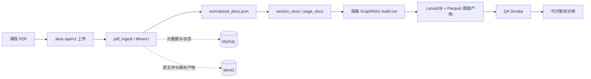
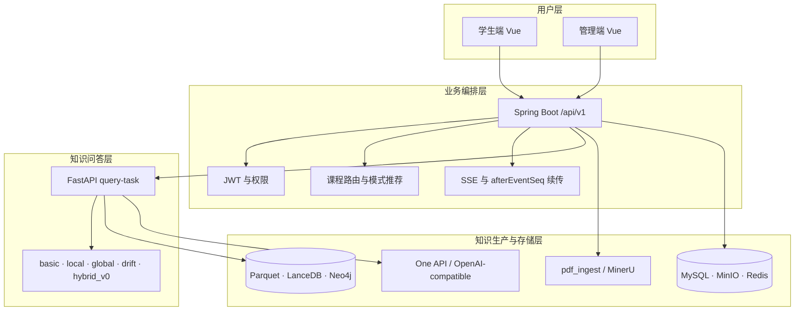
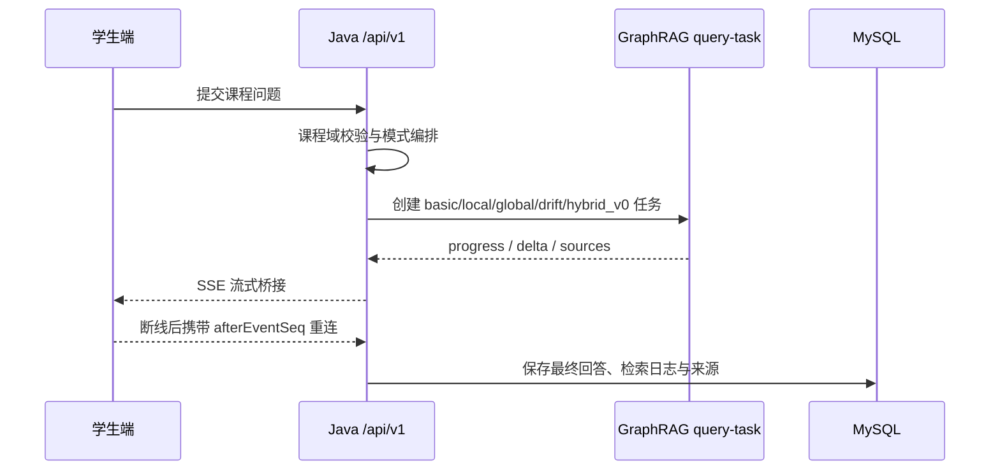
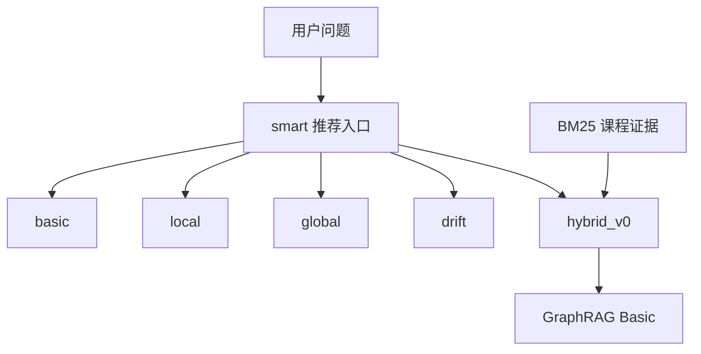

# CKQA README Project Showcase Refresh Implementation Plan

> **For agentic workers:** REQUIRED SUB-SKILL: Use superpowers:subagent-driven-development (recommended) or superpowers:executing-plans to implement this plan task-by-task. Steps use checkbox (`- [ ]`) syntax for tracking.

**Goal:** 将根目录中文 README 改造成兼具真实产品展示、架构说明和可运行开发入口的项目主页，并加入三张来自当前 CKQA 真实服务的脱敏截图。

**Architecture:** 保留 Java `/api/v1` 作为浏览器边界，启动现有 Docker、Java、GraphRAG 和两套 Vue 应用；使用仓库已有操作系统课程 PDF、已完成 GraphRAG build-run 产物和真实查询链路生成截图。README 通过原生 Markdown 图片与 Mermaid 图表达产品闭环，不修改业务代码或接口。

**Tech Stack:** Markdown、Mermaid、Playwright 1.59、Vue 3/Vite、Spring Boot 4/Java 21、FastAPI/GraphRAG 3.0.9、MySQL 8、Docker Compose

---

## 文件职责

- Create: `frontend/apps/student-app/scripts/capture-readme-screenshots.mjs` — 可重复执行的真实页面截图 CLI，只接收页面 URL、业务 ID 和输出目录，不保存凭据。
- Create: `docs/assets/readme/student-qa-demo.png` — 学生端真实课程问答截图。
- Create: `docs/assets/readme/admin-materials.png` — 管理端真实课程资料截图。
- Create: `docs/assets/readme/admin-build-smoke-demo.png` — 管理端真实构建完成态截图。
- Modify: `README.md` — 重排展示结构、加入截图、四张 Mermaid 图、产品差异、演示路径和可验证评测信息。
- Runtime only: `/tmp/ckqa-readme-existing-data.sql` — 从仓库已有操作系统课程和 build-run 19 产物恢复本地演示元数据，不提交。

本轮不修改 `README.en.md`、业务代码、`.env`、索引产物或 Docker 数据挂载配置。

### Task 1: 恢复可截图的真实本地运行态

**Files:**
- Read: `sql/ocqa.sql`
- Read: `sql/migrations/20260506_jwt_auth_credentials.sql`
- Read: `graphrag_pipeline/runtime/kb-build-runs/user_0/kb_5/build_19/manifest.json`
- Runtime only: `/tmp/ckqa-readme-existing-data.sql`

- [ ] **Step 1: 确认基础设施和数据库状态**

Run:

```bash
cd infra
docker compose ps
docker compose exec -T mysql sh -lc 'MYSQL_PWD="$MYSQL_ROOT_PASSWORD" mysql -uroot -N -B ocqa -e "SELECT COUNT(*) FROM information_schema.tables WHERE table_schema=\"ocqa\";"'
```

Expected: MySQL、MinIO、One API、Neo4j、Redis 均为 `Up`；当前本地库返回 `0`，说明只需初始化空库，不会覆盖既有业务表。

- [ ] **Step 2: 初始化空的 ocqa 数据库**

Run:

```bash
cd infra
docker compose exec -T mysql sh -lc 'MYSQL_PWD="$MYSQL_ROOT_PASSWORD" mysql -uroot ocqa' < ../sql/ocqa.sql
docker compose exec -T mysql sh -lc 'MYSQL_PWD="$MYSQL_ROOT_PASSWORD" mysql -uroot ocqa' < ../sql/migrations/20260506_jwt_auth_credentials.sql
```

Expected: 两条命令退出码均为 `0`；`courses`、`users`、`knowledge_bases`、`index_runs`、`qa_sessions` 等表存在。

- [ ] **Step 3: 写入与现有 build-run 19 对应的恢复 SQL**

Create `/tmp/ckqa-readme-existing-data.sql` with `apply_patch`:

```sql
SET NAMES utf8mb4;
START TRANSACTION;

INSERT INTO courses (
  course_id, course_name, description, category, tags, objectives, audience,
  difficulty, estimated_hours, status, access_policy
) VALUES (
  'crs-20260506-r4slkr',
  '操作系统 2026 春',
  '系统讲解进程与线程、调度与死锁、存储管理、文件系统和 I/O，并使用课程知识图谱辅助问答。',
  '计算机基础',
  JSON_ARRAY('操作系统', '进程管理', '内存管理', '文件系统', '并发', '死锁'),
  JSON_ARRAY('理解操作系统核心机制', '掌握进程调度与同步', '理解虚拟内存和文件系统'),
  JSON_ARRAY('计算机相关专业学生', '准备复习操作系统的学习者'),
  'intermediate', 64, 'active', 'restricted'
) ON DUPLICATE KEY UPDATE
  course_name=VALUES(course_name), description=VALUES(description), category=VALUES(category),
  tags=VALUES(tags), objectives=VALUES(objectives), audience=VALUES(audience),
  difficulty=VALUES(difficulty), estimated_hours=VALUES(estimated_hours), status='active';

INSERT INTO course_memberships (
  user_id, course_id, membership_role, status, access_source, joined_at, effective_from,
  change_reason, extra_metadata
)
SELECT id, 'crs-20260506-r4slkr', 'student', 'active', 'imported', NOW(), NOW(),
       '恢复仓库现有操作系统演示课程', JSON_OBJECT('test_data', true, 'source', 'readme-capture')
FROM users WHERE username='student.zhouzh'
ON DUPLICATE KEY UPDATE status='active', effective_to=NULL;

INSERT INTO material_objects (
  id, original_file_name, file_md5, file_size, mime_type, minio_bucket, minio_object_key
) VALUES (
  7, '计算机操作系统.pdf', '7b1fbd89d16197bd4708b970c8fc8ff6', 146685685,
  'application/pdf', 'course-artifacts', 'course-materials/crs-20260506-r4slkr/material_7/计算机操作系统.pdf'
) ON DUPLICATE KEY UPDATE original_file_name=VALUES(original_file_name), file_size=VALUES(file_size);

INSERT INTO course_materials (
  id, course_id, material_object_id, display_name, material_type, parse_status,
  parse_started_at, parse_finished_at, parse_progress_extracted_pages,
  parse_progress_total_pages, parse_progress_percent
) VALUES (
  7, 'crs-20260506-r4slkr', 7, '计算机操作系统教材', 'textbook', 'done',
  '2026-05-13 00:10:47', '2026-05-13 00:42:00', 408, 408, 100
) ON DUPLICATE KEY UPDATE parse_status='done', parse_progress_percent=100,
  parse_progress_extracted_pages=408, parse_progress_total_pages=408;

INSERT INTO knowledge_bases (id, course_id, kb_code, name, status, description)
VALUES (5, 'crs-20260506-r4slkr', 'os-2026-spring', '操作系统课程知识库', 'active',
        '基于计算机操作系统教材构建的 GraphRAG 课程知识库。')
ON DUPLICATE KEY UPDATE name=VALUES(name), status='active', description=VALUES(description);

INSERT INTO knowledge_base_build_runs (
  id, knowledge_base_id, course_id, requested_by_user_id, build_version, status,
  current_stage, qa_status, activation_policy, selected_material_ids, workspace_uri,
  build_metadata, started_at, finished_at
) VALUES (
  19, 5, 'crs-20260506-r4slkr', NULL, 'kb5-20260514142442972-dbd8', 'success',
  'done', 'skipped', 'index_success', JSON_ARRAY(7), 'user_0/kb_5/build_19',
  JSON_OBJECT('source', 'existing-runtime-artifact', 'migratedAt', '2026-05-19T01:57:40Z'),
  '2026-05-14 14:24:42', '2026-05-14 15:29:24'
) ON DUPLICATE KEY UPDATE status='success', current_stage='done',
  selected_material_ids=JSON_ARRAY(7), workspace_uri='user_0/kb_5/build_19';

INSERT INTO index_runs (
  id, knowledge_base_id, build_run_id, engine, index_version, status,
  started_at, finished_at, run_metadata
) VALUES (
  14, 5, 19, 'graphrag', 'auto-tuned-20260513', 'success',
  '2026-05-14 14:24:42', '2026-05-14 15:29:24',
  JSON_OBJECT(
    'workspaceUri', 'user_0/kb_5/build_19',
    'dataDirUri', 'user_0/kb_5/build_19/index/output',
    'graphSummary', JSON_OBJECT(
      'entityCount', 3776, 'relationshipCount', 9345, 'communityCount', 930,
      'communityReportCount', 930, 'documentCount', 393, 'textUnitCount', 533,
      'totalRuntimeSeconds', 3882.026
    )
  )
) ON DUPLICATE KEY UPDATE status='success', run_metadata=VALUES(run_metadata);

UPDATE knowledge_bases SET active_index_run_id=14 WHERE id=5;
UPDATE knowledge_base_build_runs SET active_index_run_id=14 WHERE id=19;

INSERT INTO index_artifacts (
  index_run_id, artifact_type, display_name, storage_uri, storage_scope, artifact_status
) VALUES
  (14, 'output_dir', 'GraphRAG 输出目录', 'user_0/kb_5/build_19/index/output', 'local', 'ready'),
  (14, 'parquet', '实体表', 'user_0/kb_5/build_19/index/output/entities.parquet', 'local', 'ready'),
  (14, 'parquet', '关系表', 'user_0/kb_5/build_19/index/output/relationships.parquet', 'local', 'ready'),
  (14, 'parquet', '文本单元表', 'user_0/kb_5/build_19/index/output/text_units.parquet', 'local', 'ready'),
  (14, 'manifest', '构建清单', 'user_0/kb_5/build_19/manifest.json', 'local', 'ready');

COMMIT;
```

- [ ] **Step 4: 执行恢复 SQL 并核对记录与磁盘产物一致**

Run:

```bash
cd infra
docker compose exec -T mysql sh -lc 'MYSQL_PWD="$MYSQL_ROOT_PASSWORD" mysql -uroot ocqa' < /tmp/ckqa-readme-existing-data.sql
docker compose exec -T mysql sh -lc 'MYSQL_PWD="$MYSQL_ROOT_PASSWORD" mysql -uroot -N -B ocqa -e "SELECT c.course_name,cm.display_name,cm.parse_status,kb.name,ir.status FROM courses c JOIN course_materials cm ON cm.course_id=c.course_id JOIN knowledge_bases kb ON kb.course_id=c.course_id JOIN index_runs ir ON ir.id=kb.active_index_run_id WHERE c.course_id=\"crs-20260506-r4slkr\";"'
test -f ../graphrag_pipeline/runtime/kb-build-runs/user_0/kb_5/build_19/index/output/entities.parquet
```

Expected: 查询返回“操作系统 2026 春 / 计算机操作系统教材 / done / 操作系统课程知识库 / success”，parquet 文件检查通过。

### Task 2: 启动真实服务并生成一条可展示问答

**Files:**
- Read: `backend/ckqa-back/.env`
- Read: `frontend/apps/student-app/.env`
- Read: `frontend/apps/admin-app/.env`

- [ ] **Step 1: 启动 Java 与 GraphRAG 服务**

Run in terminal A:

```bash
cd backend/ckqa-back
scripts/run_local_backend.sh --mailer-type log
```

Expected: Java 监听 `127.0.0.1:8080`；托管的 GraphRAG API 监听 `127.0.0.1:8012`。

- [ ] **Step 2: 验证内部与浏览器边界服务**

Run:

```bash
curl -fsS http://127.0.0.1:8012/health
curl -fsS http://127.0.0.1:8080/api/v1/system/health
```

Expected: 两个请求均返回成功 JSON；Java health 中 MySQL、MinIO、Redis 和 GraphRAG 不出现 `down`。

- [ ] **Step 3: 启动两套前端**

Run in terminal B:

```bash
cd frontend/apps/admin-app
pnpm dev:local
```

Run in terminal C:

```bash
cd frontend/apps/student-app
pnpm dev:local
```

Expected: 管理端 `5173`、学生端 `5174` 可访问。

### Task 3: 实现可重复的脱敏截图 CLI

**Files:**
- Create: `frontend/apps/student-app/scripts/capture-readme-screenshots.mjs`

- [ ] **Step 1: 写失败检查，证明截图工具尚不存在**

Run:

```bash
test -f frontend/apps/student-app/scripts/capture-readme-screenshots.mjs
```

Expected: 退出码 `1`。

- [ ] **Step 2: 创建截图 CLI**

Implement `frontend/apps/student-app/scripts/capture-readme-screenshots.mjs` with these behaviors:

```js
import { mkdir } from 'node:fs/promises'
import path from 'node:path'
import process from 'node:process'
import { fileURLToPath } from 'node:url'
import { chromium } from '@playwright/test'

function parseArgs(argv) {
  const values = new Map()
  for (let index = 0; index < argv.length; index += 2) {
    const key = argv[index]
    const value = argv[index + 1]
    if (!key?.startsWith('--') || !value) throw new Error(`无效参数：${key ?? ''}`)
    values.set(key.slice(2), value)
  }
  const required = ['student-url', 'admin-url', 'course-id', 'material-id', 'kb-id', 'build-run-id', 'out']
  for (const key of required) {
    if (!values.get(key)) throw new Error(`缺少参数 --${key}`)
  }
  return Object.fromEntries(values)
}

async function settle(page, selector) {
  await page.locator(selector).first().waitFor({ state: 'visible', timeout: 30_000 })
  await page.waitForTimeout(1200)
}

async function applyPrivacyMask(page) {
  await page.addStyleTag({ content: `
    .avatar, .identity-avatar, .topbar-identity, .user-dropdown,
    .msg-meta, .index-run-mini-card__id, .mono { visibility: hidden !important; }
  ` })
  await page.evaluate(() => {
    const privatePattern = /(student\.|admin\.|teacher\.|STU\d+|ADM\d+|TCH\d+|crs-\d{8}-[\w-]+|session[_ -]?\d+|build[_ -]?\d+)/i
    for (const element of document.querySelectorAll('span,small,p,code')) {
      if (privatePattern.test(element.textContent || '')) element.style.visibility = 'hidden'
    }
  })
}

async function loginStudent(page, baseUrl) {
  await page.goto(`${baseUrl}/login`, { waitUntil: 'domcontentloaded' })
  await page.getByRole('button', { name: '体验账号一键填入' }).click()
  await page.getByRole('button', { name: /登录学习空间/ }).click()
  await page.waitForURL(/\/home/, { timeout: 20_000 })
}

async function loginAdmin(page, baseUrl) {
  await page.goto(`${baseUrl}/login`, { waitUntil: 'domcontentloaded' })
  await page.getByRole('button', { name: /登录/ }).last().click()
  await page.waitForURL(/\/app\//, { timeout: 20_000 })
}

async function ensureStudentAnswer(page, options) {
  const url = `${options['student-url']}/qa/ask?courseId=${encodeURIComponent(options['course-id'])}&mode=basic`
  await page.goto(url, { waitUntil: 'domcontentloaded' })
  await settle(page, '.composer-input')
  await page.locator('.composer-input').fill('请给出死锁的定义，并说明产生死锁必须满足的四个条件。')
  await page.locator('.composer-input').press('Enter')
  await page.locator('.ai-bubble').filter({ hasText: '死锁' }).last().waitFor({ state: 'visible', timeout: 180_000 })
  await page.locator('.source-cards summary').last().click().catch(() => {})
  await applyPrivacyMask(page)
  await page.locator('.qa-ask-page').screenshot({
    path: path.join(options.out, 'student-qa-demo.png'),
  })
}

async function captureAdmin(page, options) {
  await page.goto(`${options['admin-url']}/app/materials/${encodeURIComponent(options['material-id'])}`, { waitUntil: 'domcontentloaded' })
  await settle(page, '.material-detail-grid')
  await applyPrivacyMask(page)
  await page.locator('.module-page').screenshot({ path: path.join(options.out, 'admin-materials.png') })

  const buildUrl = `${options['admin-url']}/app/knowledge-bases/${encodeURIComponent(options['kb-id'])}/build?buildRunId=${encodeURIComponent(options['build-run-id'])}&step=index`
  await page.goto(buildUrl, { waitUntil: 'domcontentloaded' })
  await settle(page, '.build-step-index__done')
  await applyPrivacyMask(page)
  await page.locator('.module-page').screenshot({ path: path.join(options.out, 'admin-build-smoke-demo.png') })
}

const options = parseArgs(process.argv.slice(2))
options.out = path.resolve(options.out)
await mkdir(options.out, { recursive: true })
const browser = await chromium.launch({ headless: true })
try {
  const student = await browser.newPage({ viewport: { width: 1440, height: 1000 }, deviceScaleFactor: 1 })
  await loginStudent(student, options['student-url'])
  await ensureStudentAnswer(student, options)

  const admin = await browser.newPage({ viewport: { width: 1440, height: 1000 }, deviceScaleFactor: 1 })
  await loginAdmin(admin, options['admin-url'])
  await captureAdmin(admin, options)
} finally {
  await browser.close()
}
```

- [ ] **Step 3: 运行 Node 语法检查**

Run:

```bash
node --check frontend/apps/student-app/scripts/capture-readme-screenshots.mjs
```

Expected: 无输出，退出码 `0`。

- [ ] **Step 4: 提交截图 CLI**

```bash
git add frontend/apps/student-app/scripts/capture-readme-screenshots.mjs
git commit -m "docs: 增加 README 真实截图工具"
```

### Task 4: 采集并检查真实脱敏截图

**Files:**
- Create: `docs/assets/readme/student-qa-demo.png`
- Create: `docs/assets/readme/admin-materials.png`
- Create: `docs/assets/readme/admin-build-smoke-demo.png`

- [ ] **Step 1: 安装或确认 Playwright 浏览器**

Run:

```bash
cd frontend/apps/student-app
pnpm exec playwright install chromium
```

Expected: Chromium 可用；已安装时命令快速结束。

- [ ] **Step 2: 执行截图 CLI**

Run:

```bash
cd frontend/apps/student-app
node scripts/capture-readme-screenshots.mjs \
  --student-url http://127.0.0.1:5174 \
  --admin-url http://127.0.0.1:5173 \
  --course-id crs-20260506-r4slkr \
  --material-id 7 \
  --kb-id 5 \
  --build-run-id 19 \
  --out ../../../../docs/assets/readme
```

Expected: 三个 PNG 文件生成，学生端截图包含真实 Basic 回答，管理端截图包含资料完成态和索引图谱体量。

- [ ] **Step 3: 检查格式、尺寸与体积**

Run:

```bash
file docs/assets/readme/*.png
du -h docs/assets/readme/*.png
```

Expected: 三张图均为 PNG，宽度不低于 1200px；单图优先控制在 2MB 内。

- [ ] **Step 4: 逐张视觉检查**

Use the local image viewer to inspect all three PNG files. Verify:

- 学生端能看到课程问答、Basic 模式、回答和来源/轨迹；
- 管理端能看到资料解析完成态与索引成功/图谱体量；
- 不出现用户名、真实姓名、头像、邮箱、课程 ID、会话 ID、构建 ID、本机路径或密钥；
- 遮罩未覆盖能力标题和核心数值。

- [ ] **Step 5: 提交图片资产**

```bash
git add docs/assets/readme/student-qa-demo.png docs/assets/readme/admin-materials.png docs/assets/readme/admin-build-smoke-demo.png
git commit -m "docs: 增加 CKQA 真实产品截图"
```

### Task 5: 重写 README 展示层

**Files:**
- Modify: `README.md`

- [ ] **Step 1: 写静态失败检查**

Run:

```bash
rg -n '为什么不是传统文档 RAG|知识生产链路|问答链路|Demo Walkthrough|docs/assets/readme/student-qa-demo.png' README.md
```

Expected: 至少有一个关键标题或图片路径未命中，表明展示化内容尚未落地。

- [ ] **Step 2: 在项目简介后加入学生端首图**

Insert:

```markdown
## 产品预览


学生端围绕已选课程和已激活索引发起问答，Java 统一完成课程与模式编排，再把 Python GraphRAG 的检索进度、回答增量和来源事件桥接到浏览器。
```

- [ ] **Step 3: 增加“为什么不是传统文档 RAG”对比表**

Use these rows: data source, knowledge production, retrieval, system boundary, traceability, operations. State that CKQA uses MinerU + standardized export + isolated GraphRAG build runs, five final modes, Java orchestration, page/section provenance, QA smoke/log/source review. Do not claim every mode is always better than vector RAG.

- [ ] **Step 4: Replace the text architecture with four Mermaid diagrams**

Add these sections and graph directions:

```markdown
## 知识生产链路



## 架构概览



## 问答链路



## 查询模式


```

Keep the browser boundary sentence directly after architecture. Explain `smart` is not a final mode and `hybrid_v0` is not a model name.

- [ ] **Step 5: 增加管理端能力、Demo Walkthrough 与验证/评测**

Add the two admin images with captions. Demo Walkthrough must contain: upload/parse → standardized export → isolated build → QA smoke → student question → source review. The verification section may cite only evidence re-run in Task 6; do not publish historical latency as a current guarantee.

- [ ] **Step 6: 保留并校准开发入口**

Keep the existing technology stack, prerequisites, infrastructure/Python/backend/frontend startup commands, module table, developer docs, contribution rules and current boundaries. Remove duplicate sentences created by the new diagrams.

- [ ] **Step 7: 提交 README 改造**

```bash
git add README.md
git commit -m "docs: 将 README 升级为项目展示入口"
```

### Task 6: 全量文档与展示验证

**Files:**
- Verify: `README.md`
- Verify: `docs/assets/readme/*.png`
- Verify: `frontend/apps/student-app/scripts/capture-readme-screenshots.mjs`

- [ ] **Step 1: 验证图片链接和 Mermaid 数量**

Run:

```bash
python - <<'PY'
from pathlib import Path
import re

text = Path('README.md').read_text(encoding='utf-8')
links = re.findall(r'!\[[^]]*\]\((docs/assets/readme/[^)]+)\)', text)
assert len(links) >= 3, links
for link in links:
    assert Path(link).is_file(), link
assert text.count('```mermaid') == 4
assert text.count('```') % 2 == 0
print({'images': links, 'mermaid_blocks': 4})
PY
```

Expected: 输出三张图片路径和 `mermaid_blocks: 4`。

- [ ] **Step 2: 运行前端静态回归**

Run:

```bash
cd frontend/apps/student-app
pnpm test
pnpm build
cd ../admin-app
pnpm test
pnpm build
```

Expected: 两套前端测试和构建均通过；截图工具没有进入应用生产 bundle。

- [ ] **Step 3: 运行仓库文档验证**

Run from repository root:

```bash
git diff --check HEAD~3..HEAD
python scripts/audit_repo_drift.py --strict
```

Expected: 无空白错误；输出 `[审计通过] 未发现活跃文件版本/路径/命令漂移。`

- [ ] **Step 4: 核对最终工作区与提交**

Run:

```bash
git status --short
git log -5 --oneline
```

Expected: 工作区干净；包含截图工具、图片资产和 README 三个主题提交。如验证产生必要修正，单独提交：

```bash
git add README.md frontend/apps/student-app/scripts/capture-readme-screenshots.mjs docs/assets/readme
git commit -m "docs: 修正 README 展示验证问题"
```

## 实施注意事项

- 数据库恢复只允许在 `information_schema.tables` 对 `ocqa` 返回 `0` 时执行；若发现已有表，跳过初始化与恢复 SQL，改为从现有记录选择截图对象。
- 所有服务日志不得复制到 README；命令输出中若出现密钥或令牌，不进入截图和提交。
- 截图采集过程中只新增一条真实学生问答，不触发 PDF 解析、索引重建或 QA smoke 重跑。
- 如果 Basic 查询失败，先诊断真实服务，不允许把 Mock 响应当作产品截图；可改为恢复仓库已归档的真实成功 QA 记录后再经 Java API 展示。
- 发现截图含内部标识时，修正 CLI 的 DOM 遮罩并重新采集，不使用模糊到影响可读性的后处理。

